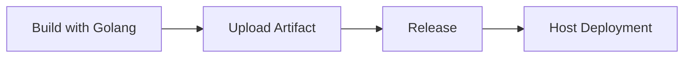

## Form Introduction

- **Golang Version Number**: Select the appropriate JDK version from the dropdown list. The plugin will initialize the JDK environment based on the selected version when executing.

- **Build Command**: The build command is a user-defined command to build the code. The command is executed in the root path of the code repository and supports ${Parameter Key} to get environment variables. Note that adding `set -e` can control the automatic exit of script commands in case of errors.

```shell
# Default to using goproxy.cn
export GOPROXY=https://goproxy.cn
# Enter Your Build Command
make build
```

- **Stash build artifacts**:
- **Unique Identifier**: The identifier for the artifact produced, which can be referenced in downstream tasks using `${Unique Identifier}` to obtain the artifact.
    - **Packaged files/directories**: Select the files or directories produced by the artifact, it can be single or multiple (these packaging directories are compressed together).

- **Build cache**:

> The cache parameter supports both absolute and relative paths, for example:

- /go/pkg/mod
- xxx/xxx relative to the root directory of the code repository
- /root/workspace/xxx

> Rule Explanation:

- The so-called cache essentially means storing the modules that are repeatedly used in our pipeline in the uploaded S3. When the pipeline is triggered again, the cache file is downloaded and extracted from S3.
Only when the pipeline build is successful will the updated cache files be uploaded
- Cache files expire by default after 30 days
- Each time the pipeline is triggered, the cache expiration can be extended (even if the build fails)

## Notes:

### Accelerating Golang builds

By default, go build will pull related dependencies from GitHub, which can be very slow

To speed up the build process, you can set up a domestic mirror source:

```shell
export GO111MODULE=on
export GOPROXY=https://mirrors.aliyun.com/goproxy/
```

### Build Binary Files (Different Environments)

There are compatibility issues when building binary files in Go. Binary files from different environments cannot be executed across environments.

To build the binary file of the execution environment, you can execute the following command to select the environment:

```shell
CGO_ENABLED=0 GOOS=linux GOARCH=amd64 go build main.go
set CGO_ENABLED=0
Set GOOS to linux. Specifies the operating system (Windows, Linux, Darwin 'macOS').
set GOARCH=amd64 # Represents the target system architecture (arm, arm64, 386, amd64, etc.)
go build
```

### Create RPM Offline Package

The fpm plugin is built-in, which can be used to package the built binary file into an offline RPM package.

Execute command:

```shell
## Parameter description: -n binary file name -v version number -p rpm file name -f location to store the generated rpm file
fpm -s dir -t rpm -n record-mdk -v ${AGILE_PIPELINE_BUILD_NUMBER} -p record-mdk-${AGILE_PIPELINE_BUILD_NUMBER}.x86_64.rpm -f record-mdk=/usr/local/
```

## Common combinations:

### Image Build and Deployment (Single Artifact)

```mermaid
graph LR
A [Go Build] --> B [Image Build] --> C [K8S Deployment]
    B --> D[Helm Chart Deployment]
```

### Artifact Upload and Deployment (Single Artifact)



### Image Build and Deployment (Multiple Artifacts)

```mermaid
graph LR
A [Go Build] --> B [Image Build] --> C [K8S Deployment]
A --> D[Mirror Build] --> F[Helm Chart Deployment]
A --> E[Image Build] --> G[K8S Deployment]
```