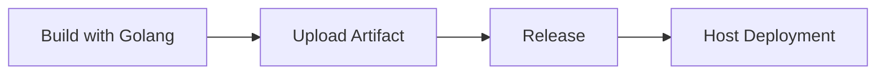

## Знакомство с формой

- **Номер версии Golang**: Выберите соответствующую версию JDK из выпадающего списка. Плагин инициализирует окружение JDK на основе выбранной версии при выполнении.

- **Команда сборки**: Команда сборки - это пользовательская команда для сборки кода. Команда выполняется по корневому пути репозитория кода и поддерживает ${Parameter Key} для получения переменных окружения. Обратите внимание, что добавление `set -e` может управлять автоматическим завершением команд скрипта в случае ошибок.

```shell
# По умолчанию используется goproxy.cn
export GOPROXY=https://goproxy.cn
# Введите команду сборки
make build
```

- **Артефакты сборки в корзине**:
- **Уникальный идентификатор**: Идентификатор созданного артефакта, на который можно ссылаться в последующих задачах, используя `${Unique Identifier}` для получения артефакта.
    - **Упакованные файлы/каталоги**: Выберите файлы или каталоги, созданные артефактом, их может быть один или несколько (эти упаковочные каталоги сжимаются вместе).

- **Кэш сборки**:

> Параметр кэша поддерживает как абсолютные, так и относительные пути, например:

- /go/pkg/mod
- xxx/xxx относительно корневого каталога хранилища кода
- /root/workspace/xxx

> Пояснение правила:

- Так называемый кэш по сути означает хранение модулей, которые неоднократно используются в нашем конвейере, в загруженном S3. Когда конвейер запускается снова, файл кэша загружается и извлекается из S3.
Только после успешной сборки конвейера обновленные файлы кэша будут загружены.
- Срок действия файлов кэша по умолчанию истекает через 30 дней.
- При каждом запуске конвейера срок действия кэша может быть продлен (даже если сборка не удалась)

## Примечания:

### Ускорение сборки Golang

По умолчанию go build будет извлекать связанные зависимости с GitHub, что может быть очень медленным.

Чтобы ускорить процесс сборки, вы можете установить внутренний зеркальный источник:

```shell
export GO111MODULE=on
export GOPROXY=https://mirrors.aliyun.com/goproxy/
```

### Сборка бинарных файлов (различные среды)

При сборке бинарных файлов в Go возникают проблемы с совместимостью. Двоичные файлы из разных окружений не могут быть выполнены в разных окружениях.

Чтобы собрать двоичный файл из среды выполнения, вы можете выполнить следующую команду для выбора среды:

```shell
CGO_ENABLED=0 GOOS=linux GOARCH=amd64 go build main.go
set CGO_ENABLED=0
Set GOOS to linux. Specifies the operating system (Windows, Linux, Darwin 'macOS').
set GOARCH=amd64 # Represents the target system architecture (arm, arm64, 386, amd64, etc.)
go build
```

### Создание автономного пакета RPM

Встроенный плагин fpm позволяет упаковать собранный бинарный файл в автономный RPM-пакет.

Выполните команду:

```shell
## Описание параметров: -n имя двоичного файла -v номер версии -p имя rpm-файла -f место хранения сгенерированного rpm-файла
fpm -s dir -t rpm -n record-mdk -v ${AGILE_PIPELINE_BUILD_NUMBER} -p record-mdk-${AGILE_PIPELINE_BUILD_NUMBER}.x86_64.rpm -f record-mdk=/usr/local/
```

## Общие комбинации:

### Сборка и развертывание образа (один артефакт)

```mermaid
graph LR
A [Go Build] --> B [Image Build] --> C [K8S Deployment]
    B --> D[Helm Chart Deployment]
```

### Загрузка и развертывание артефактов (один артефакт)



### Сборка и развертывание образов (несколько артефактов)

```mermaid
graph LR
A [Go Build] --> B [Image Build] --> C [K8S Deployment]
A --> D[Mirror Build] --> F[Helm Chart Deployment]
A --> E[Image Build] --> G[K8S Deployment]
```