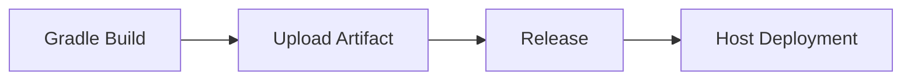

## Form Introduction

- **JDK Version**: Select the appropriate JDK version from the dropdown list. The plugin will initialize the JDK environment based on the selected version.

- **Gradle Version Number**: Select the appropriate Gradle version from the dropdown list. The plugin will initialize the Gradle environment based on the selected version.

- **Build Command**: The build command is a user-defined command for building. The command is executed in the root directory of the code repository and supports accessing environment variables using ${parameter key}. Note that adding 'set -e' can control the automatic exit of script commands if there is an error.

```shell
# Default build command for Gradle
chmod +x ./gradlew
./gradlew build
```

- **Stash build artifacts**:
- **Unique Identifier**: The identifier for the artifact produced, which can be referenced in downstream tasks using `${Unique Identifier}` to obtain the artifact.
    - **Packaged files/directories**: Select the files or directories produced by the artifact, it can be single or multiple (these packaging directories are compressed together).

- **Build cache**:

> The cache parameter supports both absolute and relative paths, for example:

- ~/.gradle/caches
- xxx/xxx relative to the root directory of the code repository
- /root/workspace/xxx

> Rule Explanation:

- By caching, we essentially store the modules that are reused in our pipeline in a packed S3. When the pipeline is triggered again, the cache file is downloaded and decompressed from S3.
Only when the pipeline build is successful will the updated cache files be uploaded
- Cache files expire by default after 30 days
- Each time the pipeline is triggered, the cache expiration can be extended (even if the build fails)

## Notes:

### Set Dependency Source

- Take effect for a single project: modify build.gradle
- Globally effective for projects: Create init.gradle under /root/.gradle/init.gradle

### Build Acceleration

To speed up the building efficiency, the plugin sets the default dependency source to Aliyun

Create init.gradle under /root/.gradle/init.gradle

```gradle
allprojects{
    repositories {
        def ALIYUN_REPOSITORY_URL = 'https://maven.aliyun.com/repository/public/'
        def ALIYUN_JCENTER_URL = 'https://maven.aliyun.com/repository/jcenter/'
        def ALIYUN_GOOGLE_URL = 'https://maven.aliyun.com/repository/google/'
        def ALIYUN_GRADLE_PLUGIN_URL = 'https://maven.aliyun.com/repository/gradle-plugin/'
        all { ArtifactRepository repo ->
            if(repo instanceof MavenArtifactRepository){
                def url = repo.url.toString()
                if (url.startsWith('https://repo1.maven.org/maven2/')) {
                    project.logger.lifecycle "Repository ${repo.url} replaced by $ALIYUN_REPOSITORY_URL."
                    remove repo
                }
                if (url.startsWith('https://jcenter.bintray.com/')) {
                    project.logger.lifecycle "Repository ${repo.url} replaced by $ALIYUN_JCENTER_URL."
                    remove repo
                }
                if (url.startsWith('https://dl.google.com/dl/android/maven2/')) {
                    project.logger.lifecycle "Repository ${repo.url} replaced by $ALIYUN_GOOGLE_URL."
                    remove repo
                }
                if (url.startsWith('https://plugins.gradle.org/m2/')) {
                    project.logger.lifecycle "Repository ${repo.url} replaced by $ALIYUN_GRADLE_PLUGIN_URL."
                    remove repo
                }
            }
        }
        maven { url ALIYUN_REPOSITORY_URL }
        maven { url ALIYUN_JCENTER_URL }
        maven { url ALIYUN_GOOGLE_URL }
        maven { url ALIYUN_GRADLE_PLUGIN_URL }
    }
}
```

## Common combinations:

### Image Build and Deployment (Single Artifact)

```mermaid
graph LR
Gradle Build --> Image Build --> K8S Deployment
    B --> D[Helm Chart Deployment]
```

### Artifact Upload and Deployment (Single Artifact)



### Image Build and Deployment (Multiple Artifacts)

```mermaid
graph LR
Gradle Build --> Image Build --> K8S Deployment
A --> D[Mirror Build] --> F[Helm Chart Deployment]
A --> E[Image Build] --> G[K8S Deployment]
```