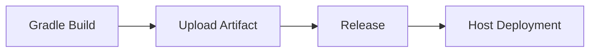

## Знакомство с формой

- **Версия JDK**: Выберите подходящую версию JDK из выпадающего списка. Плагин инициализирует среду JDK на основе выбранной версии.

- **Номер версии Gradle**: Выберите соответствующую версию Gradle из выпадающего списка. Плагин инициализирует среду Gradle в соответствии с выбранной версией.

- **Команда сборки**: Команда build - это пользовательская команда для сборки. Команда выполняется в корневом каталоге репозитория кода и поддерживает доступ к переменным окружения с помощью ${parameter key}. Обратите внимание, что добавление 'set -e' может управлять автоматическим завершением команд скрипта при возникновении ошибки.

```shell
# Default build command for Gradle
chmod +x ./gradlew
./gradlew build
```

- **Артефакты сборки в корзине**:
- **Уникальный идентификатор**: Идентификатор созданного артефакта, на который можно ссылаться в последующих задачах, используя `${Unique Identifier}` для получения артефакта.
    - **Упакованные файлы/каталоги**: Выберите файлы или каталоги, созданные артефактом, их может быть один или несколько (эти упаковочные каталоги сжимаются вместе).

- **Кэш сборки**:

> Параметр cache поддерживает как абсолютные, так и относительные пути, например:

- ~/.gradle/caches
- xxx/xxx относительно корневого каталога репозитория кода
- /root/workspace/xxx

> Объяснение правила:

- С помощью кэширования мы храним модули, которые повторно используются в нашем конвейере, в упакованном файле S3. Когда конвейер запускается снова, файл кэша загружается и распаковывается из S3.
Только после успешной сборки конвейера обновленные файлы кэша будут загружены.
- Срок действия файлов кэша по умолчанию истекает через 30 дней.
- При каждом запуске конвейера срок действия кэша может быть продлен (даже если сборка не удалась)

## Примечания:

### Установить источник зависимостей

- Вступает в силу для одного проекта: modify build.gradle
- Действует глобально для проектов: Создайте init.gradle в каталоге /root/.gradle/init.gradle

### Ускорение сборки

Чтобы ускорить сборку, плагин устанавливает источником зависимостей по умолчанию Aliyun

Создать init.gradle в каталоге /root/.gradle/init.gradle

```gradle
allprojects{
    repositories {
        def ALIYUN_REPOSITORY_URL = 'https://maven.aliyun.com/repository/public/'
        def ALIYUN_JCENTER_URL = 'https://maven.aliyun.com/repository/jcenter/'
        def ALIYUN_GOOGLE_URL = 'https://maven.aliyun.com/repository/google/'
        def ALIYUN_GRADLE_PLUGIN_URL = 'https://maven.aliyun.com/repository/gradle-plugin/'
        all { ArtifactRepository repo ->
            if(repo instanceof MavenArtifactRepository){
                def url = repo.url.toString()
                if (url.startsWith('https://repo1.maven.org/maven2/')) {
                    project.logger.lifecycle "Repository ${repo.url} replaced by $ALIYUN_REPOSITORY_URL."
                    remove repo
                }
                if (url.startsWith('https://jcenter.bintray.com/')) {
                    project.logger.lifecycle "Repository ${repo.url} replaced by $ALIYUN_JCENTER_URL."
                    remove repo
                }
                if (url.startsWith('https://dl.google.com/dl/android/maven2/')) {
                    project.logger.lifecycle "Repository ${repo.url} replaced by $ALIYUN_GOOGLE_URL."
                    remove repo
                }
                if (url.startsWith('https://plugins.gradle.org/m2/')) {
                    project.logger.lifecycle "Repository ${repo.url} replaced by $ALIYUN_GRADLE_PLUGIN_URL."
                    remove repo
                }
            }
        }
        maven { url ALIYUN_REPOSITORY_URL }
        maven { url ALIYUN_JCENTER_URL }
        maven { url ALIYUN_GOOGLE_URL }
        maven { url ALIYUN_GRADLE_PLUGIN_URL }
    }
}
```

## Общие комбинации:

### Сборка и развертывание образа (один артефакт)

```mermaid
graph LR
Gradle Build --> Image Build --> K8S Deployment
    B --> D[Helm Chart Deployment]
```

### Загрузка и развертывание артефактов (один артефакт)



### Сборка и развертывание образов (несколько артефактов)

```mermaid
graph LR
Gradle Build --> Image Build --> K8S Deployment
A --> D[Mirror Build] --> F[Helm Chart Deployment]
A --> E[Image Build] --> G[K8S Deployment]
```