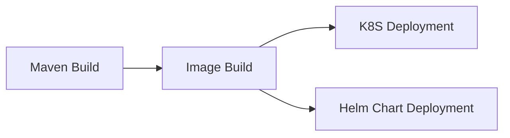
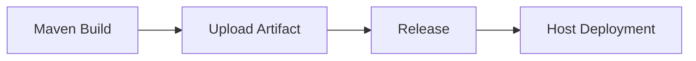
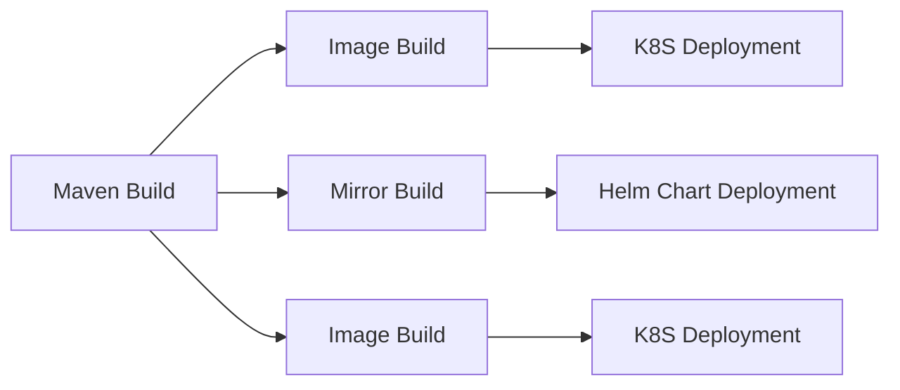

## Form Introduction

- **Repository URL**: Docker image repository URL, such as hub.docker.com
- **Repository Username**: Mirror Repository Authentication Username
- **Repository Password**: Authentication password for the image repository
- **Image Tag**: Image tag, such as tomcat:v1.${GITEE_PIPELINE_BUILD_NUMBER}, supports system parameters or custom parameters of the pipeline.
Dockerfile path: relative path to the root directory of the code repository, such as ./Dockerfile
- **Context**: Context is the context for Docker build. Please fill in the path relative to the root directory of the code repository, such as
- **Pull upstream outputs**: Pull upstream outputs, can be configured multiple times, such as ${BUILD_ARTIFACT}. Supports system parameters and direct input of a pull address; the default decompression path is the code repository root directory, if configured.
- **Docker Cache**: Do not use cache, docker build will use the parameter --no-cache=true for image building.
- **Build parameters**: Set build parameters (--build-arg)
- **Output Parameter Alias**: After this task is successfully executed, the following parameters will be automatically output and passed on to downstream tasks. To avoid parameter conflicts between multiple identical tasks, you can customize the alias of the parameter and directly use the parameter value in the downstream task as ${parameter_name}.

## Notes:

- When using image building, try not to install dependencies and download code during image building (some basic dependencies or common configurations should be placed in the base image), ensuring that the Dockerfile has very few things that can change. This way, the image build process will be much faster than when creating the image.

## Common combinations:

### Image Build and Deployment (Single Artifact)

### Artifact Upload and Deployment (Single Artifact)

### Image Build and Deployment (Multiple Artifacts)

  