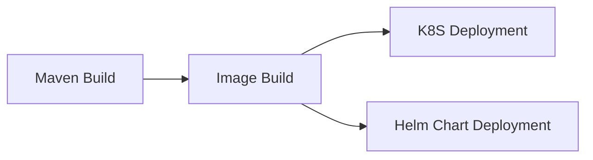
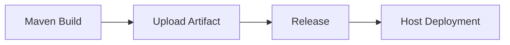
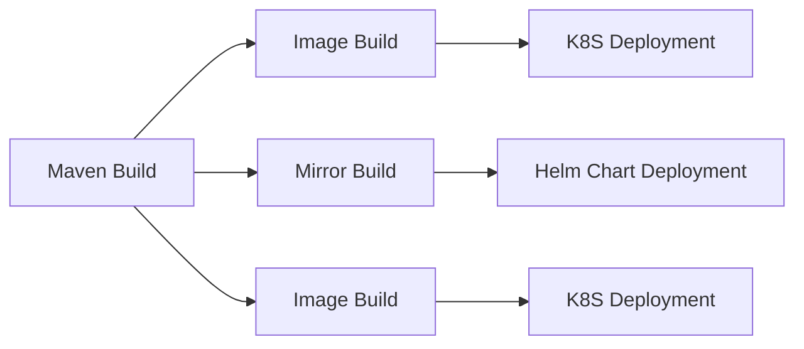

## Знакомство с формой

- **URL-адрес репозитория**: URL-адрес репозитория образов Docker, например, hub.docker.com.
- **Имя пользователя репозитория**: Имя пользователя для аутентификации зеркального репозитория
- **Пароль репозитория**: Пароль аутентификации для хранилища изображений
- **Тег изображения**: Тег образа, например tomcat:v1.${GITEE_PIPELINE_BUILD_NUMBER}, поддерживает системные параметры или пользовательские параметры конвейера.
Путь к файлу Docker: относительный путь к корневому каталогу репозитория кода, например ./Dockerfile
- **Контекст**: Контекст - это контекст для сборки Docker. Укажите путь относительно корневой директории репозитория кода, например
- **Отправка результатов для выгрузки данных**: Pull upstream outputs, может быть настроен несколько раз, например ${BUILD_ARTIFACT}. Поддерживает системные параметры и прямой ввод адреса pull; путь распаковки по умолчанию - корневой каталог репозитория кода, если он настроен.
- **Кэш Docker**: Не использовать кэш, сборка docker будет использовать параметр --no-cache=true для сборки образа.
- **Параметры сборки**: Установка параметров сборки (--build-arg).
- **Псевдоним выходного параметра**: После успешного выполнения этой задачи следующие параметры будут автоматически выведены и переданы последующим задачам. Чтобы избежать конфликтов параметров между несколькими одинаковыми задачами, вы можете настроить псевдоним параметра и напрямую использовать значение параметра в последующих задачах как ${имя_параметра}.

## Примечания:

- При использовании сборки образов старайтесь не устанавливать зависимости и не загружать код во время сборки образа (некоторые базовые зависимости или общие конфигурации должны быть помещены в базовый образ), чтобы в Dockerfile было очень мало объектов, которые могут измениться. Таким образом, процесс сборки образа будет выполняться намного быстрее, чем его создание.

## Общие комбинации:

### Сборка и развертывание образа (один артефакт)

### Загрузка и развертывание артефактов (один артефакт)

### Сборка и развертывание образов (несколько артефактов)

  