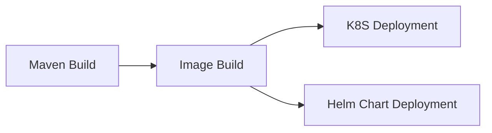
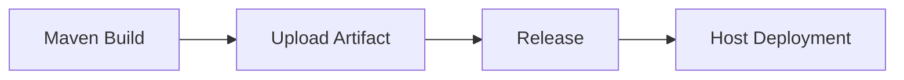
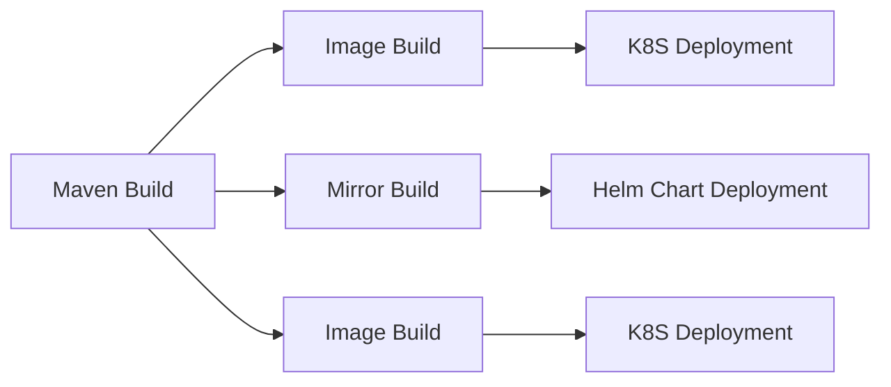

## Form Introduction

- **JDK Version**: Select the appropriate JDK version from the dropdown list. The plugin will initialize the JDK environment based on the selected version.
  
- **Maven Version**: Select the appropriate Maven version from the dropdown list. The plugin will initialize the Maven environment based on the selected version during execution.
  
- **Build Command**: The build command is a user-defined command to build the code. The command is executed in the root path of the code repository and supports ${Parameter Key} to get environment variables. Note that adding `set -e` can control the automatic exit of script commands in case of errors.

```shell
# Function: Packaging
# Parameter Description:
#    -Dmaven.test.skip=true: Skip unit tests
#    -U: Check for dependency updates each time the build is performed, which can avoid the problem of snapshot version dependencies not being updated in the cache, but sacrifices some performance.
#    -e -X: Print debug information, recommended to use this parameter for troubleshooting build issues
#    -B: Runs in batch mode, which can avoid ArrayIndexOutOfBoundsException exceptions when printing logs.
# Use case: Use when packaging a project and do not need to execute unit tests
mvn clean package -Dmaven.test.skip=true -U -e -X -B

# Function: Custom settings configuration
# Use case: If you need to manually specify settings.xml, you can use the following method
# Note: If you don't need to customize the settings configuration and need a private dependency repository, you can add private dependencies in the 'Private Repository' section of this task
# mvn -U clean package -s ./settings.xml
```

- **Stash build artifacts**:
- **Unique Identifier**: The identifier for the artifact produced, which can be referenced in downstream tasks using `${Unique Identifier}` to obtain the artifact.
    - **Packaged files/directories**: Select the files or directories produced by the artifact, it can be single or multiple (these packaging directories are compressed together).

- **Private repository**:
- **Repository Credentials**: You can manage your remote dependency repositories by adding credentials. Please refer to [Maven Settings Credentials Configuration](/enterprise/pipeline/enterprise-setup/certificate/introduce#others) for adding credentials.
    - **Repository Type**: Release repository or snapshot repository.

- **Build cache**:

> The cache parameter supports both absolute and relative paths, for example:

- /root/.m2
- ~/.m2
- xxx/xxx relative to the root directory of the code repository
- /root/workspace/xxx

> Rule Explanation:

- The so-called cache essentially means storing the modules that are repeatedly used in our pipeline in the uploaded S3. When the pipeline is triggered again, the cache file is downloaded and extracted from S3.
Only when the pipeline build is successful will the updated cache files be uploaded
- Cache files expire by default after 30 days
- Each time the pipeline is triggered, the cache expiration can be extended (even if the build fails)

## Common combinations:

### Image Build and Deployment (Single Artifact)



### Artifact Upload and Deployment (Single Artifact)



### Image Build and Deployment (Multiple Artifacts)

