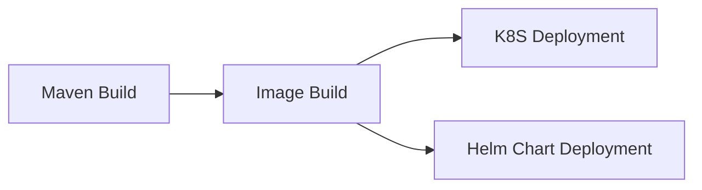
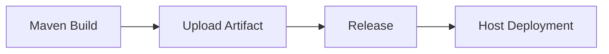
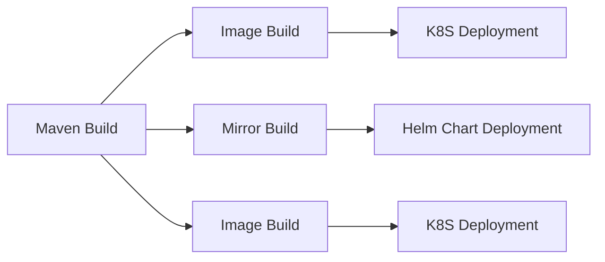

## Знакомство с формой

- **Версия JDK**: Выберите соответствующую версию JDK из выпадающего списка. Плагин инициализирует окружение JDK на основе выбранной версии.
  
- **Версия Maven**: Выберите соответствующую версию Maven из выпадающего списка. Во время выполнения плагин инициализирует окружение Maven на основе выбранной версии.
  
- **Команда сборки**: Команда сборки - это пользовательская команда для сборки кода. Команда выполняется по корневому пути репозитория кода и поддерживает ${Parameter Key} для получения переменных окружения. Обратите внимание, что добавление `set -e` может управлять автоматическим завершением команд скрипта в случае ошибок.

```shell
# Функция: Упаковка
# Описание параметра:
# -Dmaven.test.skip=true: Пропускать модульные тесты
# -U: Проверять обновления зависимостей при каждом выполнении сборки, что позволяет избежать проблемы, когда зависимости от версии снапшота не обновляются в кэше, но жертвует некоторой производительностью.
# -e -X: Выводить отладочную информацию, рекомендуется использовать этот параметр для устранения проблем со сборкой.
# -B: Запуск в пакетном режиме, что позволяет избежать исключений ArrayIndexOutOfBoundsException при печати журналов.
# Use case: Используется при упаковке проекта и отсутствии необходимости выполнять модульные тесты
mvn clean package -Dmaven.test.skip=true -U -e -X -B

# Функция: Конфигурация пользовательских настроек
# Случай использования: Если вам нужно вручную указать settings.xml, вы можете использовать следующий метод.
# Примечание: Если вам не нужно настраивать конфигурацию настроек и требуется частный репозиторий зависимостей, вы можете добавить частные зависимости в разделе 'Частный репозиторий' этой задачи
mvn -U clean package -s ./settings.xml
```

- **Артефакты сборки в корзине**:
- **Уникальный идентификатор**: Идентификатор созданного артефакта, на который можно ссылаться в последующих задачах, используя `${Unique Identifier}` для получения артефакта.
    - **Упакованные файлы/каталоги**: Выберите файлы или каталоги, созданные артефактом, их может быть один или несколько (эти упаковочные каталоги сжимаются вместе).

- **Частный репозиторий**:
- **Учетные данные репозитория**: Вы можете управлять удаленными репозиториями зависимостей, добавив учетные данные. Обратитесь к [Конфигурации учетных данных в настройках Maven](/enterprise/pipeline/enterprise-setup/certificate/introduce#others) для добавления учетных данных.
    - **Тип репозитория**: Релизный репозиторий или репозиторий моментальных снимков.

- **Кэш сборки**:

> Параметр кэша поддерживает как абсолютные, так и относительные пути, например:

- /root/.m2
- ~/.m2
- xxx/xxx относительно корневого каталога хранилища кода
- /root/workspace/xxx

> Пояснение правила:

- Так называемый кэш по сути означает хранение модулей, которые неоднократно используются в нашем конвейере, в загруженном S3. Когда конвейер запускается снова, файл кэша загружается и извлекается из S3.
Только после успешной сборки конвейера обновленные файлы кэша будут загружены.
- Срок действия файлов кэша по умолчанию истекает через 30 дней.
- При каждом запуске конвейера срок действия кэша может быть продлен (даже если сборка не удалась)

## Общие комбинации:

### Сборка и развертывание образа (один артефакт)



### Загрузка и развертывание артефактов (один артефакт)



### Сборка и развертывание образов (несколько артефактов)

