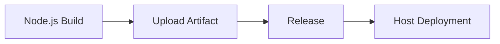

## Form Introduction

Select the appropriate Node version from the dropdown list, and the plugin will initialize the Node environment based on the selected version during execution.
  
- **Build Command**: The build command is a user-defined command to build the code. The command is executed in the root path of the code repository and supports ${Parameter Key} to get environment variables. Note that adding `set -e` can control the automatic exit of script commands in case of errors.

```shell
# Set NPM source to improve installation speed
npm config set registry https://registry.npmmirror.com

Execute the compilation command
npm install && npm run build
```

- **Stash build artifacts**:
- **Unique Identifier**: The identifier for the artifact produced, which can be referenced in downstream tasks using `${Unique Identifier}` to obtain the artifact.
    - **Packaged files/directories**: Select the files or directories produced by the artifact, it can be single or multiple (these packaging directories are compressed together).

- **Build cache**:

> The default cache directory for npm is: ~/.npm, but you can customize the cache path using the npm command line: npm config set cache /root/xxx/.npm. If the default cache directory (~/.npm) is set in the pipeline, it will become invalid and needs to be changed to (/root/xxx/.npm). The cache parameter supports absolute and relative paths. For example:

- ~/.npm
- xxx/xxx relative to the root directory of the code repository
- /root/workspace/xxx

> Rule Explanation:

- The so-called cache essentially means storing the modules that are repeatedly used in our pipeline in the uploaded S3. When the pipeline is triggered again, the cache file is downloaded and extracted from S3.
Only when the pipeline build is successful will the updated cache files be uploaded
- Cache files expire by default after 30 days
- Each time the pipeline is triggered, the cache expiration can be extended (even if the build fails)

## Common combinations:

### Image Build and Deployment (Single Artifact)

```mermaid
graph LR
A [Nodejs build] -> B [Image build] -> C [K8S deployment]
    B --> D[Helm Chart Deployment]
```

### Artifact Upload and Deployment (Single Artifact)



### Image Build and Deployment (Multiple Artifacts)

```mermaid
graph LR
A [Nodejs build] -> B [Image build] -> C [K8S deployment]
A --> D[Mirror Build] --> F[Helm Chart Deployment]
A --> E[Image Build] --> G[K8S Deployment]
```
  