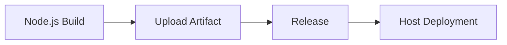

## Знакомство с формой

Выберите подходящую версию Node из выпадающего списка, и плагин инициализирует окружение Node на основе выбранной версии во время выполнения.
  
- **Команда сборки**: Команда сборки - это пользовательская команда для сборки кода. Команда выполняется по корневому пути репозитория кода и поддерживает ${Parameter Key} для получения переменных окружения. Обратите внимание, что добавление `set -e` может управлять автоматическим выходом команд скрипта в случае ошибок.

```shell
# Установите источник NPM для повышения скорости установки
npm config set registry https://registry.npmmirror.com

Выполните команду компиляции
npm install && npm run build
```

- **Артефакты сборки в корзине**:
- **Уникальный идентификатор**: Идентификатор созданного артефакта, на который можно ссылаться в последующих задачах, используя `${Unique Identifier}` для получения артефакта.
    - **Упакованные файлы/каталоги**: Выберите файлы или каталоги, созданные артефактом - их может быть один или несколько (эти упаковочные каталоги сжимаются вместе).

- **Кэш сборки**:

> По умолчанию каталог кэша для npm выглядит так: ~/.npm, но вы можете настроить путь кэша с помощью командной строки npm: npm config set cache /root/xxx/.npm. Если в конвейере установлен каталог кэша по умолчанию (~/.npm), он станет недействительным и его нужно будет изменить на (/root/xxx/.npm). Параметр cache поддерживает абсолютные и относительные пути. Например:

- ~/.npm
- xxx/xxx относительно корневого каталога репозитория кода
- /root/workspace/xxx

> Объяснение правила:

- Так называемый кэш по сути означает хранение модулей, которые неоднократно используются в нашем конвейере, в загруженном S3. Когда конвейер запускается снова, файл кэша загружается и извлекается из S3.
Только после успешной сборки конвейера обновленные файлы кэша будут загружены.
- Срок действия файлов кэша по умолчанию истекает через 30 дней.
- При каждом запуске конвейера срок действия кэша может быть продлен (даже если сборка не удалась)

## Общие комбинации:

### Сборка и развертывание образа (один артефакт)

```mermaid
graph LR
A [Nodejs build] -> B [Image build] -> C [K8S deployment]
    B --> D[Helm Chart Deployment]
```

### Загрузка и развертывание артефактов (один артефакт)



### Сборка и развертывание образов (несколько артефактов)

```mermaid
graph LR
A [Nodejs build] -> B [Image build] -> C [K8S deployment]
A --> D[Mirror Build] --> F[Helm Chart Deployment]
A --> E[Image Build] --> G[K8S Deployment]
```
  