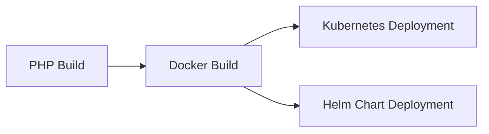
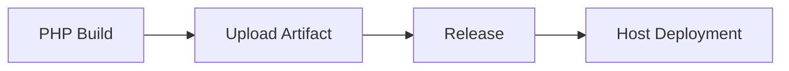
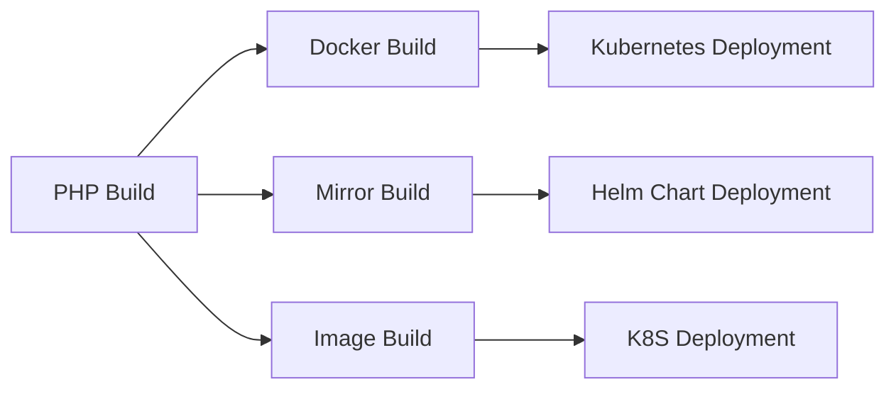

## Знакомство с формой

- **Номер версии PHP**: Выберите подходящую версию PHP из выпадающего списка. Плагин инициализирует окружение PHP в соответствии с выбранной версией.

- **Команда сборки**: Команда сборки - это пользовательская команда для сборки кода. Команда выполняется по корневому пути репозитория кода и поддерживает ${Parameter Key} для получения переменных окружения. Обратите внимание, что добавление `set -e` может управлять автоматическим завершением команд скрипта в случае ошибок.

```shell
# Set the global composer dependency repository address
composer config -g secure-http false
composer config -g repo.packagist composer https://mirrors.aliyun.com/composer/
composer install
php -v
```

- **Артефакты сборки в корзине**:
- **Уникальный идентификатор**: Идентификатор созданного артефакта, на который можно ссылаться в последующих задачах, используя `${Unique Identifier}` для получения артефакта.
    - **Упакованные файлы/каталоги**: Выберите файлы или каталоги, созданные артефактом - их может быть один или несколько (эти упаковочные каталоги сжимаются вместе).

- **Кэш сборки**:

> Параметр кэша поддерживает как абсолютные, так и относительные пути, например:

- xxx/xxx относительно корневого каталога хранилища кода
- /root/workspace/xxx

> Пояснение правила:

- Так называемый кэш по сути означает хранение модулей, которые неоднократно используются в нашем конвейере, в загруженном S3. Когда конвейер запускается снова, файл кэша загружается и извлекается из S3.
Только после успешной сборки конвейера обновленные файлы кэша будут загружены.
- Срок действия файлов кэша по умолчанию истекает через 30 дней.
- При каждом запуске конвейера срок действия кэша может быть продлен (даже если сборка не удалась)

## Примечания:

### Сценарий выполнения команд

Вы можете сохранить в коде пользовательские команды, введенные в поле ввода, аналогично build.sh. Преимущества: Это может предотвратить удаление конвейера и невозможность найти предыдущие команды сборки после этого.

## Распространенные комбинации:

### Сборка и развертывание образа (один артефакт)



### Загрузка и развертывание артефактов (один артефакт)



### Сборка и развертывание образов (несколько артефактов)

