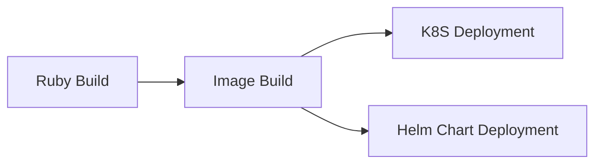
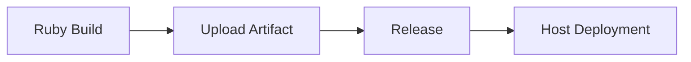
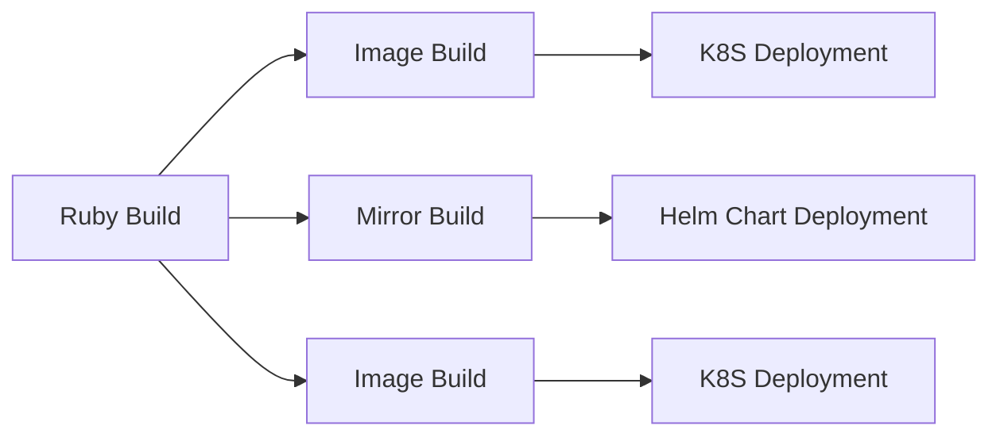

## Form Introduction

- **Ruby version number**: Select the appropriate Ruby version from the dropdown list. The plugin will initialize the Ruby environment based on the selected version when executing.

- **Build Command**: The build command is a user-defined command to build the code. The command is executed in the root path of the code repository and supports ${Parameter Key} to get environment variables. Note that adding `set -e` can control the automatic exit of script commands in case of errors.

```shell
bundle install
chmod +x -R bin
bin/rails webpacker:install
bin/rails db:migrate RAILS_ENV=test
bin/rails test
RAILS_ENV=production bin/rails assets:precompile
```

- **Stash build artifacts**:
- **Unique Identifier**: The identifier for the artifact produced, which can be referenced in downstream tasks using `${Unique Identifier}` to obtain the artifact.
    - **Packaged files/directories**: Select the files or directories produced by the artifact, it can be single or multiple (these packaging directories are compressed together).

- **Build cache**:

> The cache parameter supports both absolute and relative paths, for example:

- xxx/xxx relative to the root directory of the code repository
- /root/workspace/xxx

> Rule Explanation:

- The so-called cache essentially means storing the modules that are repeatedly used in our pipeline in the uploaded S3. When the pipeline is triggered again, the cache file is downloaded and extracted from S3.
Only when the pipeline build is successful will the updated cache files be uploaded
- Cache files expire by default after 30 days
- Each time the pipeline is triggered, the cache expiration can be extended (even if the build fails)

## Notes:

### Execute Command Script

You can maintain the user commands entered in the input box in the code, similar to build.sh. Benefits: It can prevent the deletion of the pipeline and not being able to find the previous build commands after that.

## Common combinations:

### Image Build and Deployment (Single Artifact)



### Artifact Upload and Deployment (Single Artifact)



### Image Build and Deployment (Multiple Artifacts)

