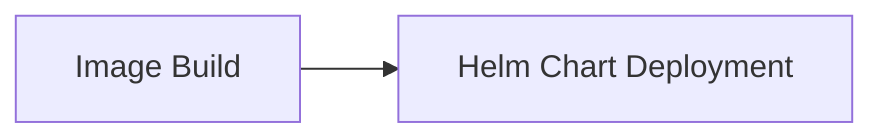

## Знакомство с формой

- **Версия Helm**: Выберите используемую версию Helm, в настоящее время доступны версии 3.4.0 и 2.17.0.

Сертификат кластера: Используйте сертификат кластера для подключения к кластеру служб Kubernetes.

- **Пространство имен**: Пространство имен в Kubernetes, по умолчанию.

- **Имя приложения**: Имя приложения - это имя целевого приложения для текущего выпуска, например: "k8s-app".

- **Каталог файла диаграммы**: Каталог файла Chart - это относительный путь к определению Chart в репозитории исходного кода, например: "helm-config/app".

- **Указать values.yaml**: Укажите путь к файлу values.yaml в каталоге Chart.

## Общие комбинации:

