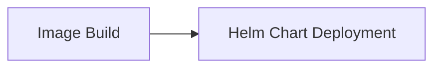

## Form Introduction

- **Helm Version**: Select the Helm version used, currently providing 3.4.0 and 2.17.0.

Cluster Certificate: Use the cluster certificate to connect to the Kubernetes service cluster

- **Namespace**: Namespace under Kubernetes, default is default.

- **App Name**: The application name is the target application name for the current release, for example: "k8s-app".

- **Chart File Directory**: The Chart file directory is the relative path of the Chart definition in the source code repository, for example: "helm-config/app".

- **Specify values.yaml**: Specify the path of values.yaml in the Chart directory.

## Common combinations:

