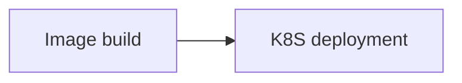

## Form Introduction

- **Kubectl Version**: The Kubectl version is the version of the kubectl client used in the current step. Please select the Kubectl version compatible with the cluster, the default version is v1.16.4.

Cluster Certificate: Use the cluster certificate to connect to the Kubernetes service cluster

- **Namespace**: Namespace under Kubernetes, default is default.
  
- YAML Path: The YAML path is the relative path of the YAML file to be deployed in the source code. For example, "./manifests.yaml".

- **Using Replace mode**: Suitable for scenarios where kubectl apply may not correctly calculate the diff and update the application when using kubectl install for the initial deployment. Note that the replace mode only supports Kubernetes clusters with imported certificates.

- **Skip TLS Verification**: Skip TLS verification. When the custom certificate declares insecure-skip-tls-verify as true, this configuration needs to be selected to ensure that kubectl skips verification.

- **Variables**: Variables are placeholders that need to be dynamically replaced. Variable values support obtaining global variables in the pipeline using ${variable key}. In YAML, you can use placeholders like ${GITEE_DOCKER_IMAGE} and they will be automatically replaced during deployment.

## Tips for Use

In yaml files, ${} can be used as a placeholder for dynamically replacing variables that need to be replaced during actual usage.

For example, the image of `spec.template.spec.containers.image` can be obtained using the variable `GITEE_DOCKER_IMAGE`.

```yaml
apiVersion: apps/v1
kind: Deployment
metadata:
  name: my-nginx
spec:
  replicas: 1
  selector:
    matchLabels:
      app: nginx
  template:
    metadata:
      labels:
        app: nginx
    spec:
      containers:
      - name: nginx
        image: ${GITEE_DOCKER_IMAGE}
        ports:
        - containerPort: 80
---
apiVersion: v1
kind: Service
metadata:
  name: ngx-service
  labels:
    app: nginx
spec:
  type: NodePort
  selector:
    app: nginx
  ports:
  - port: 80
    targetPort: 80
    nodePort: 32500
```

## Common combinations:

