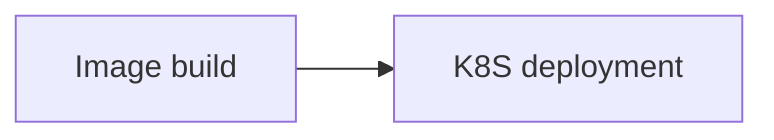

## Знакомство с формой

- **Версия Kubectl**: Версия Kubectl - это версия клиента kubectl, используемого на текущем шаге. Пожалуйста, выберите версию Kubectl, совместимую с кластером, по умолчанию используется версия v1.16.4.

Сертификат кластера: Используйте сертификат кластера для подключения к кластеру служб Kubernetes.

- **Пространство имен**: Пространство имен в Kubernetes, по умолчанию - default.
  
- Путь YAML: Путь YAML - это относительный путь к файлу YAML, который необходимо развернуть в исходном коде. Например, "./manifests.yaml".

- **Использование режима замены**: Подходит для сценариев, в которых kubectl apply может некорректно рассчитать разницу и обновить приложение при использовании kubectl install для первоначального развертывания. Обратите внимание, что режим замены поддерживает только кластеры Kubernetes с импортированными сертификатами.

- **Пропустить проверку TLS**: Пропустить проверку TLS. Если в пользовательском сертификате объявлено значение insecure-skip-tls-verify как true, необходимо выбрать эту конфигурацию, чтобы kubectl пропускал проверку.

- **Переменные**: Переменные - это заполнители, которые необходимо динамически заменять. Значения переменных поддерживают получение глобальных переменных в конвейере с помощью ${ключ переменной}. В YAML вы можете использовать такие заполнители, как ${GITEE_DOCKER_IMAGE}, и они будут автоматически заменяться во время развертывания.

## Советы по использованию

В yaml-файлах ${} можно использовать в качестве заполнителя для динамической замены переменных, которые должны быть заменены в процессе использования.

Например, изображение `spec.template.spec.containers.image` может быть получено с помощью переменной `GITEE_DOCKER_IMAGE`.

```yaml
apiVersion: apps/v1
kind: Deployment
metadata:
  name: my-nginx
spec:
  replicas: 1
  selector:
    matchLabels:
      app: nginx
  template:
    metadata:
      labels:
        app: nginx
    spec:
      containers:
      - name: nginx
        image: ${GITEE_DOCKER_IMAGE}
        ports:
        - containerPort: 80
---
apiVersion: v1
kind: Service
metadata:
  name: ngx-service
  labels:
    app: nginx
spec:
  type: NodePort
  selector:
    app: nginx
  ports:
  - port: 80
    targetPort: 80
    nodePort: 32500
```

## Общие комбинации:

