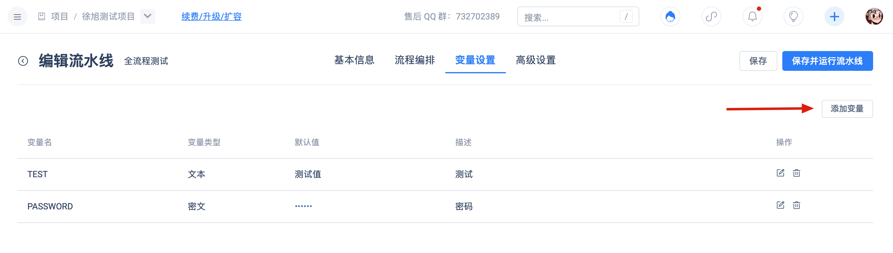

Pipeline-level parameters are user-defined parameters that can be used in any stage or task within the pipeline. The words 'GITEE_' and 'GO_' are reserved by the system. Pipeline-level parameters are user-defined and can be changed. You can change or create parameters by executing the following command: 'echo 'Key=Value' >> GITEE_PARAMS', where

## Use Cases

1. Add variables

2. Task Using Variables
