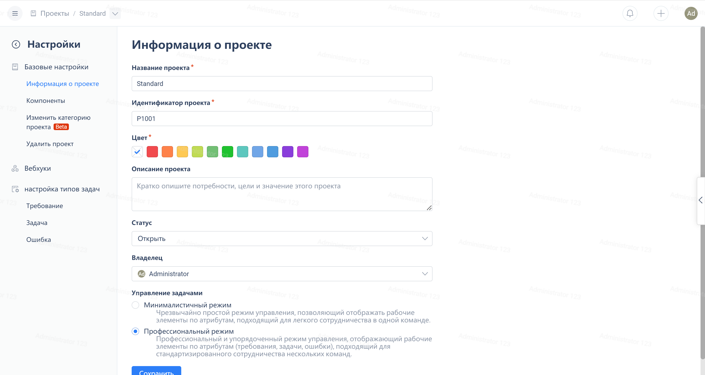
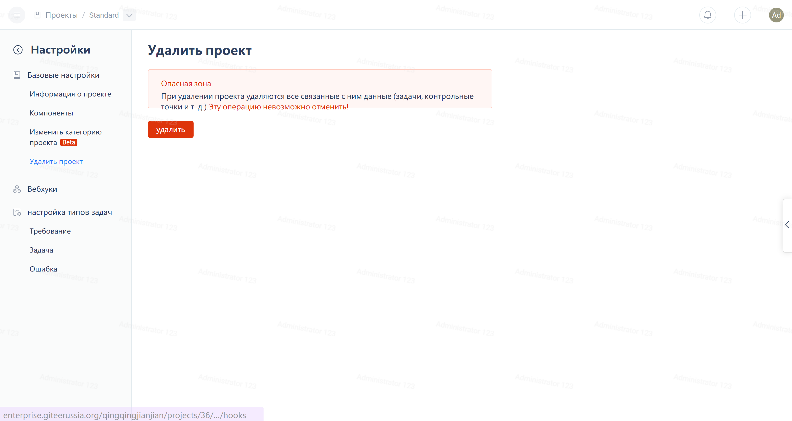

В нижней части навигационного меню проекта нажмите на "Настройки проекта":

Нажмите на "Удалить проект" слева в меню настроек проекта, затем подтвердите нажатием на кнопку "Подтвердить удаление".

