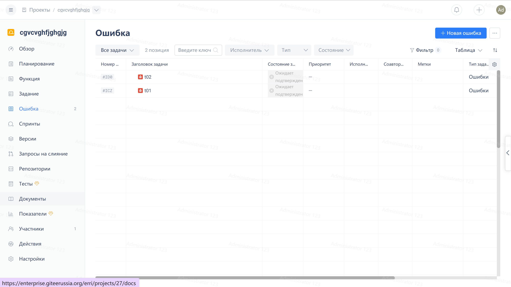
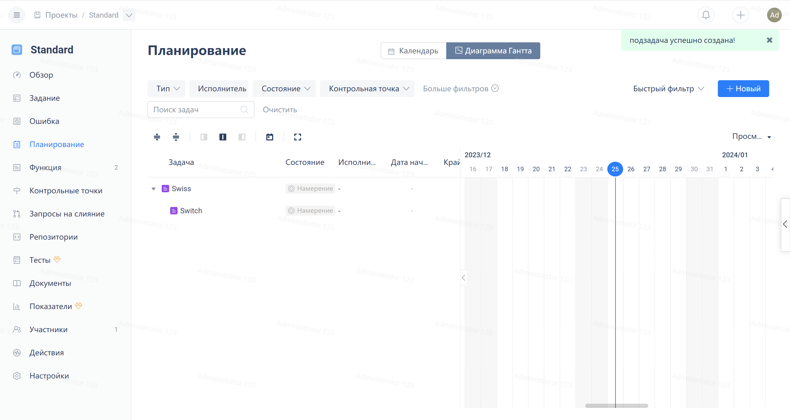
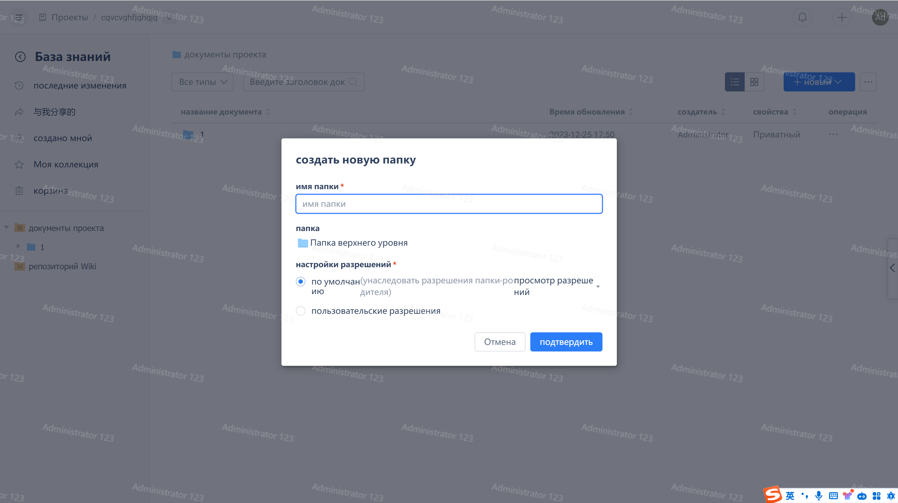

Click "Knowledge Base" in the project navigation menu:

Click the "New" button in the upper right corner, then click "New Document" in the dropdown menu:

Enter the document name and adjust the permission settings according to actual needs.

