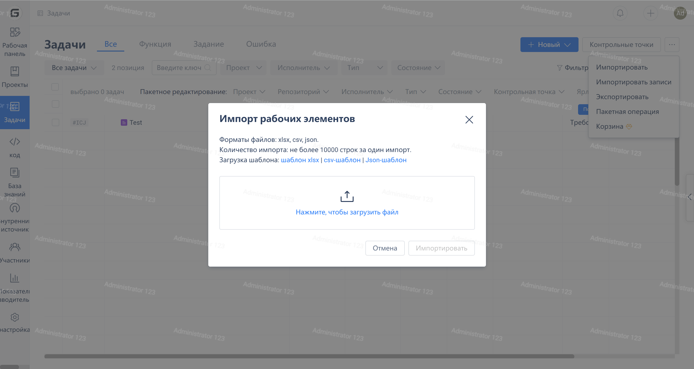
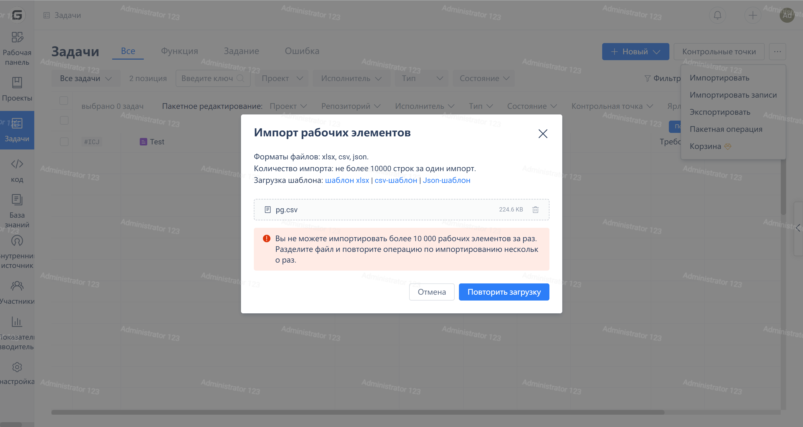

После ввхода на страницу списка рабочих элементов выберите "Импортировать" из меню "..." в правом верхнем углу, чтобы открыть окно импорта рабочего элемента.

В окне "Импорт рабочего элемента" вы можете загрузить и просмотреть файл-шаблон для данных рабочего элемента. Нажмите на область посередине чтобы выбрать файл, который вы хотите загрузить, затем нажмите на кнопку "Импорт", чтобы запустить процедуру импорта.

Если обнаружится проблема с содержимым импортируемого файла, отобразится окно с сообщением об ошибке. Для просмотра подробной информации об ошибке нажмите на ссылку "Скачать файл проверки".

Нажмите на элемент "..." в меню и выберите "История импорта" для просмотра записей исторического импорта