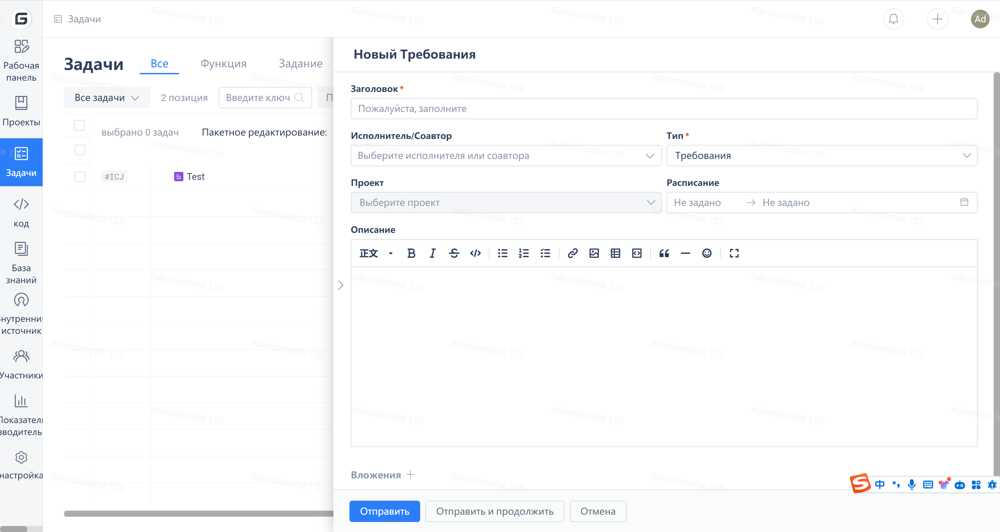
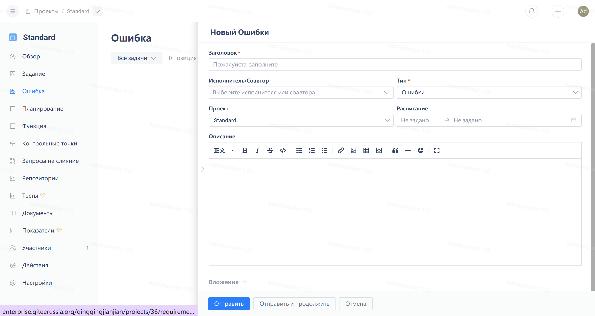

В правом верхнем углу нового меню для выбора доступны три типа рабочих элементов: требования, задачи и дефекты.

В меню проекта слева вы можете перейти на страницы "Требования", "Задачи" или "Дефекты". В правом верхнем углу находится кнопка создания рабочих элементов соответствующих типов.

