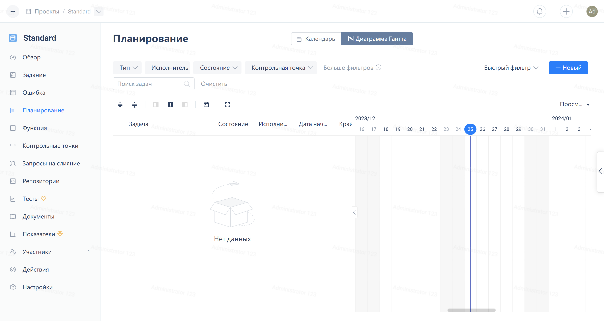

Нажмите на "Планирование" слева в меню навигации проекта чтобы использовать профессиональные инструменты диаграммы Ганта. Пользователи могут моментально забронировать рабочие элементы и определять зависимости между рабочими элементами с помощью диаграммы Ганта.

