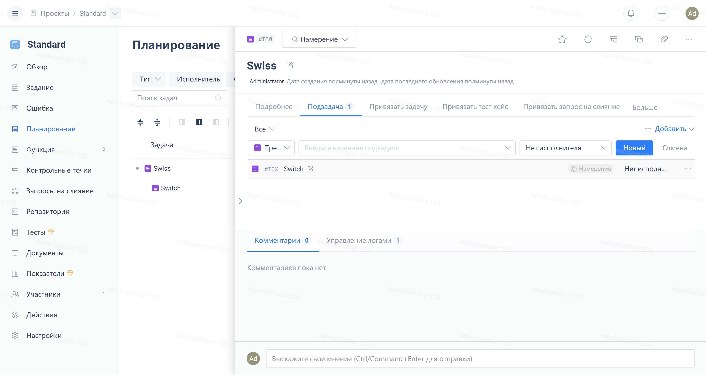

Откройте любой рабочий элемент из списка, нажмите на вкладку "Дочерние рабочие элементы", выберите тип рабочего элемента из расположенного справа меню "Добавить". Затем введите заголовок дочернего рабочего элемента в поле ввода и нажмите кнопку "Создать".

Для быстрого создания дочернего рабочего элемента вы можете нажать в табличном отображении рабочего элемента на иконку справа от заголовка рабочего элемента.

