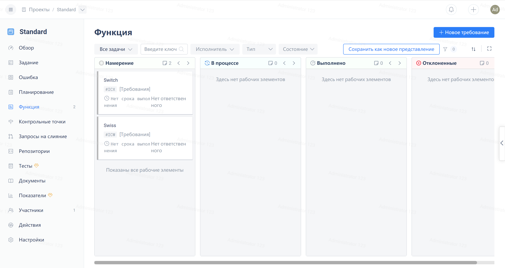

> Kanban view is an important tool for visualizing workflows and can effectively help teams identify issues.

Click on the view dropdown menu at the right end of the filter bar, then hover over the 'Kanban' option, and select the appropriate Kanban view from the expanded submenu.

