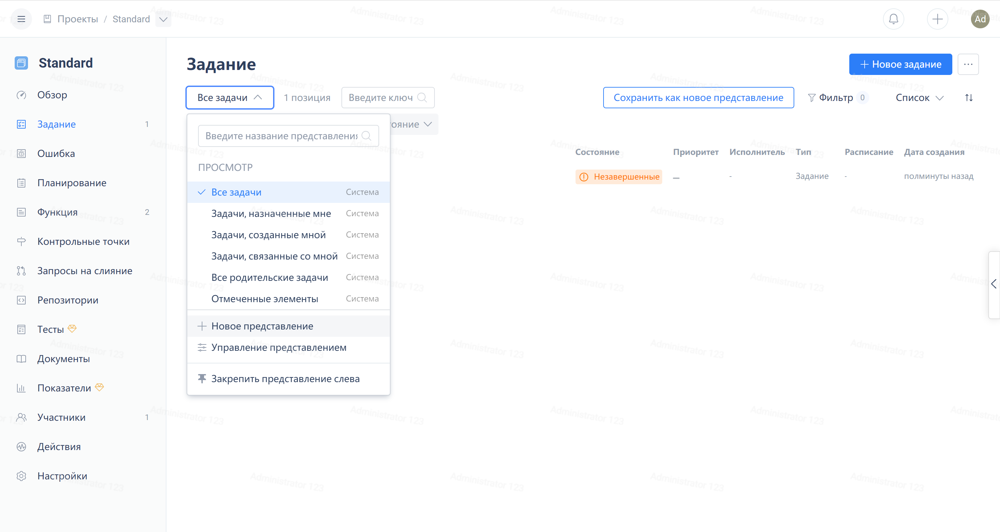
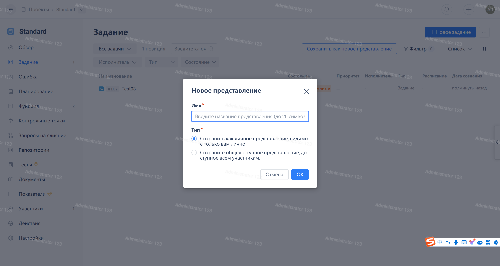
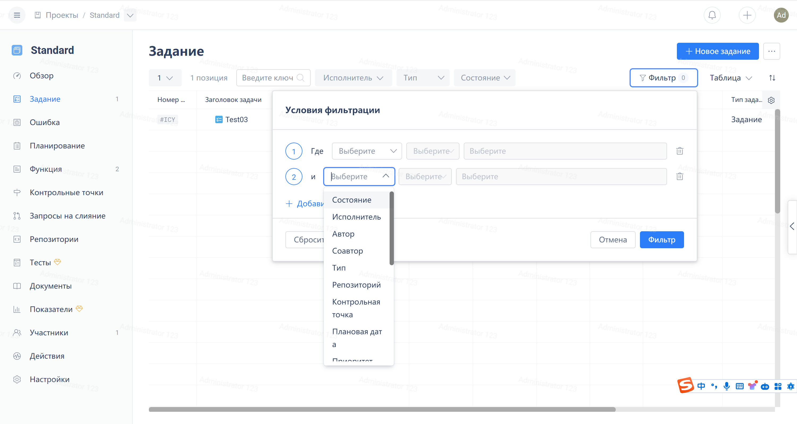
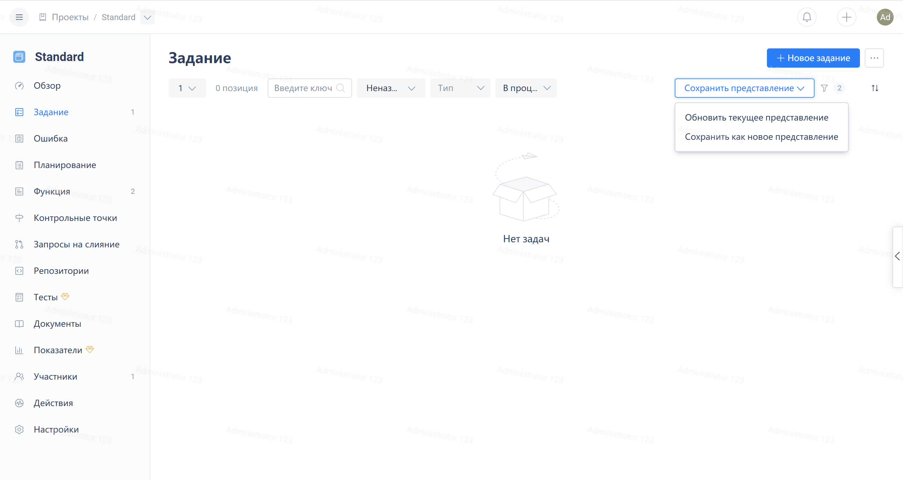
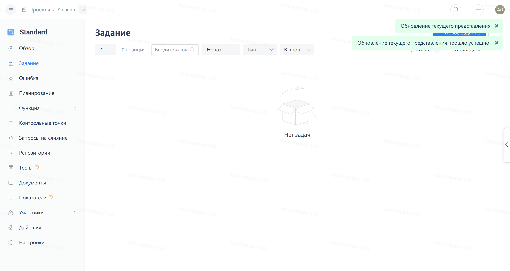

Нажмите на выпадающее меню в левой части панели фильтров, а затем нажмите на опцию "Создать новый" в меню:

Чтобы создать новую пустую доску, введите название доски в всплывающем окне "Новая доска" и нажмите кнопку "Сохранить".

Нажмите на "Фильтры" в правом верхнем углу панели фильтров. После добавления комбинации фильтров, нажмите на кнопку "Применить фильтры" справа внизу панели инструментов, чтобы применить комбинацию фильтров.

Нажмите на опции в всплывающем окне "Сохранить доску" чтобы сохранить текущую комбинацию фильтров.

Если текущая доска создана как личная доска, опций сохранения будет две:

