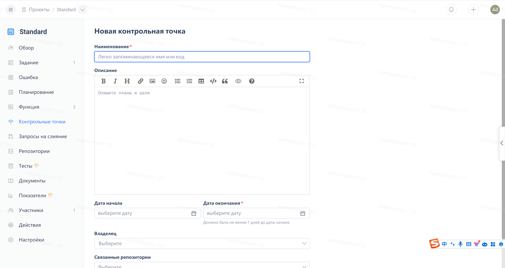

Нажмите на "Этап" в меню навигации стандартного проекта, а затем нажмите на кнопку "Новый этап" в правом верхнем углу:

После заполнения названия этапа, его описания, даты окончания и других полей, нажмите на кнопку "Новый". 

