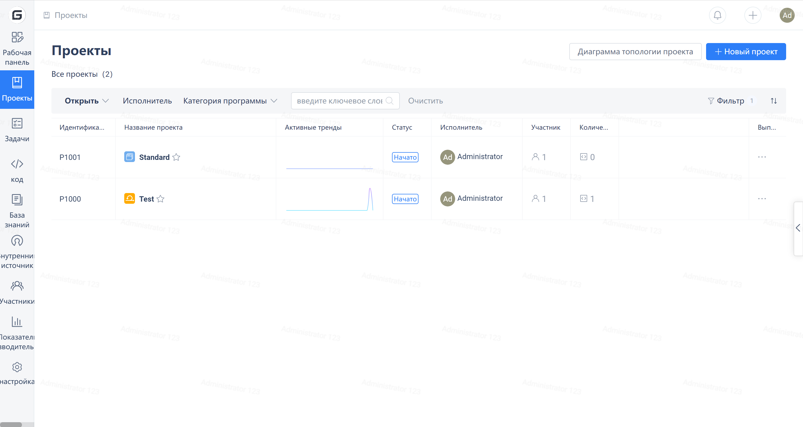
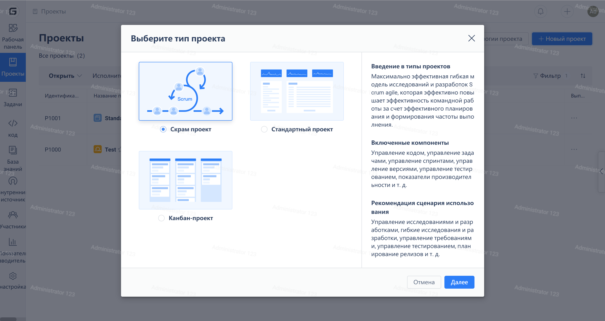

Click "Projects" in the left navigation menu to enter the project list page, then click the "New Project" button in the upper right corner.

Select "Kanban project" in the pop-up "Select project type" window.

