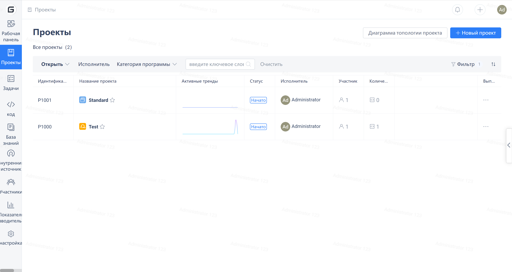
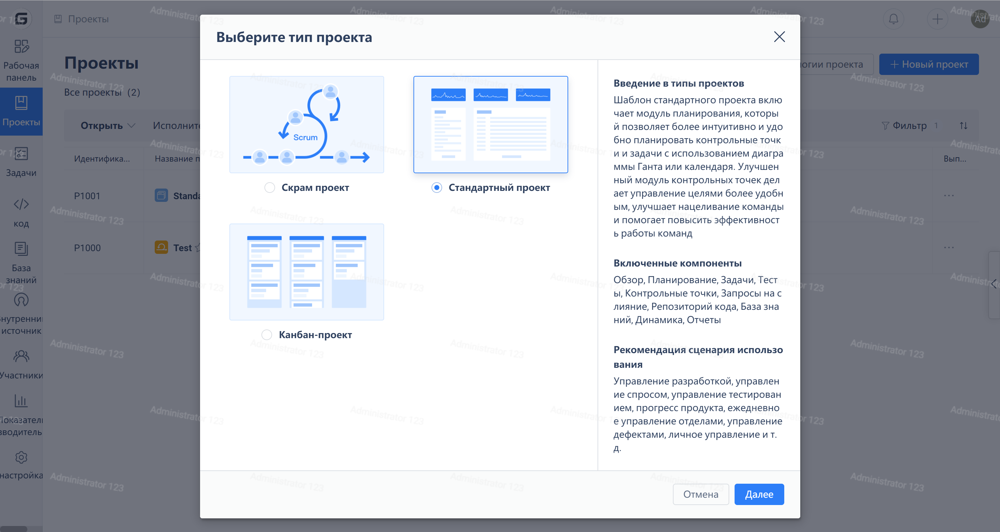

Нажмите на "Проекты" в навигационном меню слева для перехода на страницу списка проектов. Затем нажмите на кнопку "Новый проект" в правом верхнем углу.

Выберите "Стандартный проект" во всплывающем окне "Выберите тип проекта".

