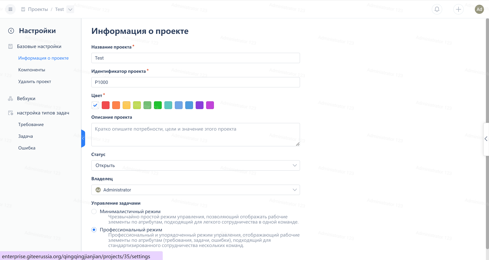
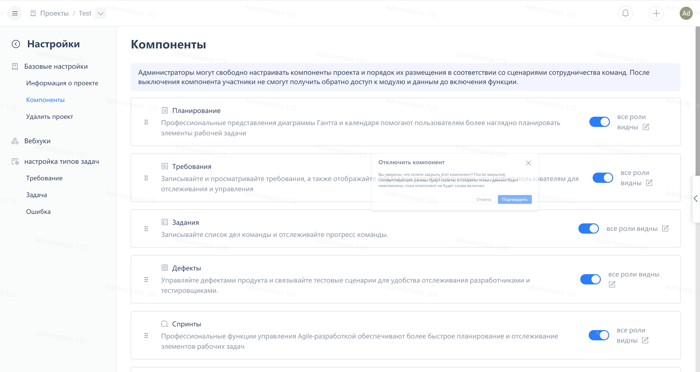
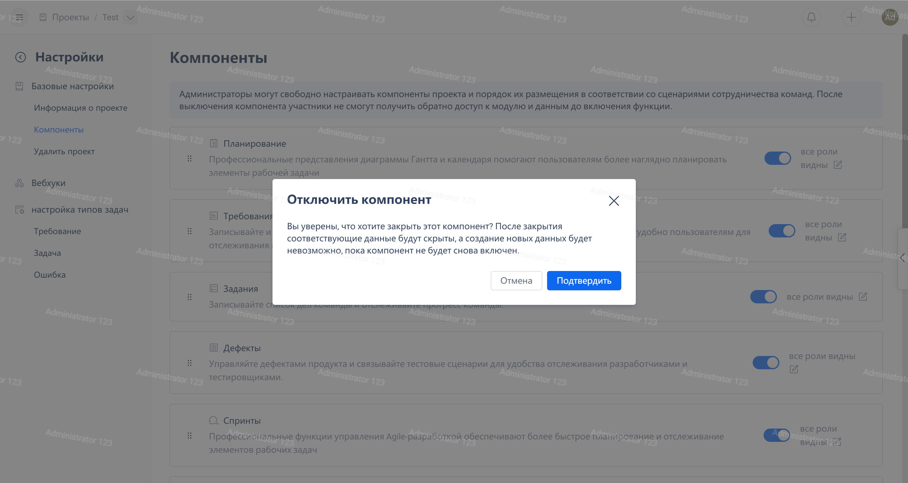

Click on the bottom of the project navigation menu, "Project Settings":

Click "Component Settings" to see the enable status of each component.
Drag and drop the handle on the left side of the component up and down to adjust the order of the component in the project navigation menu.

Clicking the switch on the right end of the component card can turn on or off the component. When the component is turned off, its entry in the project menu will be hidden.

