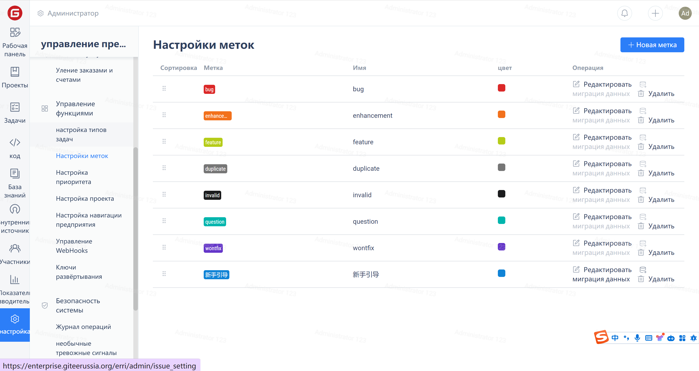
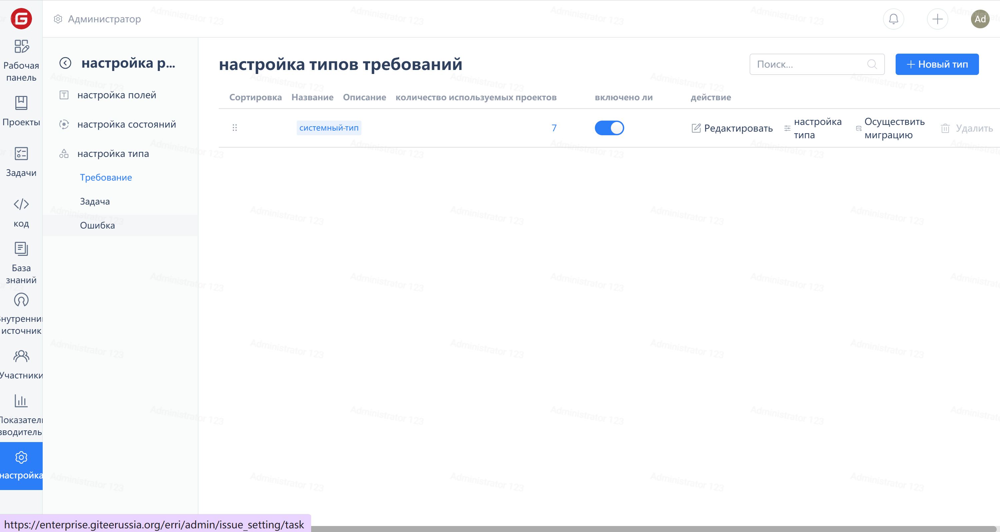
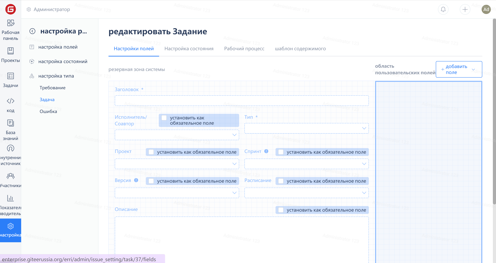

Click on 'Settings' in the Enterprise Navigation Menu, then click on 'Work Item Settings' in the Enterprise Management Menu:

Click on the work item type attribute under the "Work Item Settings" group to enter the settings page, then click on the "Configure Type" link.

On this page, you can add, delete, sort, and make fields mandatory for this work item type.

