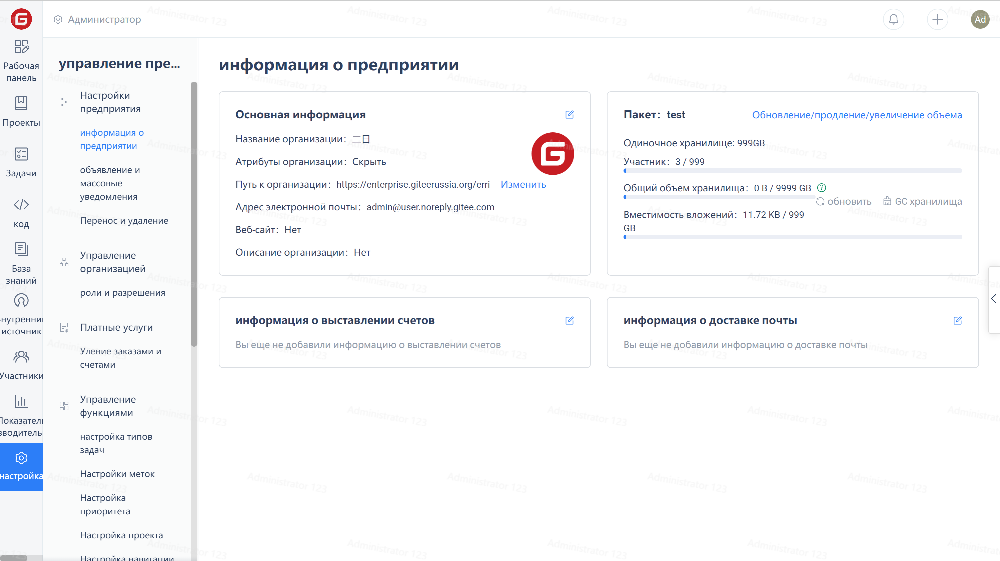
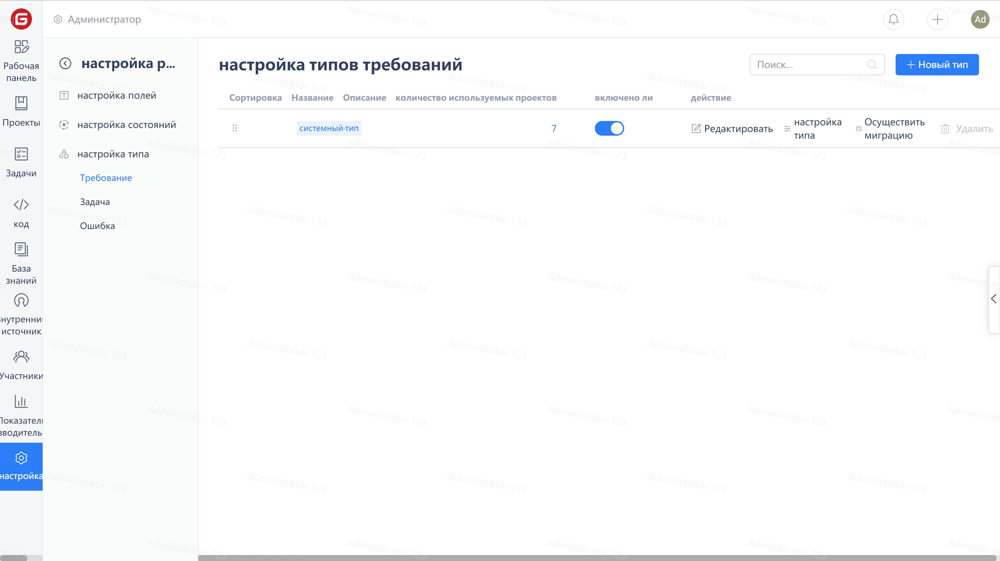
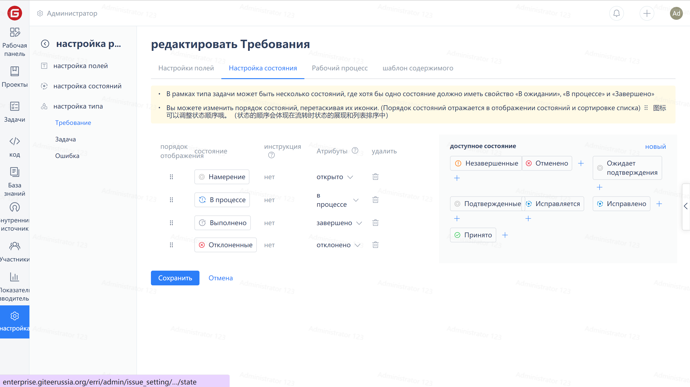

## Настройка статусов

Нажмите на "Настройки" в навигационном меню предприятия, затем нажмите на "Настройки рабочих элементов" в меню управления предприятием:

Нажмите на "Настройка  статусов". На этой странице можно создать, отредактировать и удалить статусы.

Настройка статуса рабочего элемента

Нажмите на любой тип рабочего элемента под "Типами рабочих элементов" и затем нажмите на "Настроить типы"

Нажмите на "Настройки статусов" чтобы настроить статус выбранного рабочего элемента

Примечание: Правильная настройка атрибутов статуса поможет разработчикам стандартизировать процессы и обеспечить основу для статистики рабочих элементов.

>**К выполнению** Это начальный статус рабочего процесса обозначающий начало работы над рабочим элементом.
>
>**В работе** Этот статус рабочего процесса обозначающий что рабочий элемент находится в работе.
>
**Выполнен** Это окончательный статус рабочего процесса, указывающий на то, что работа над рабочим элементом завершена.
>
**Отклонено** Это статус прерывания рабочего процесса, обозначающий отклонение или отмену задачи.