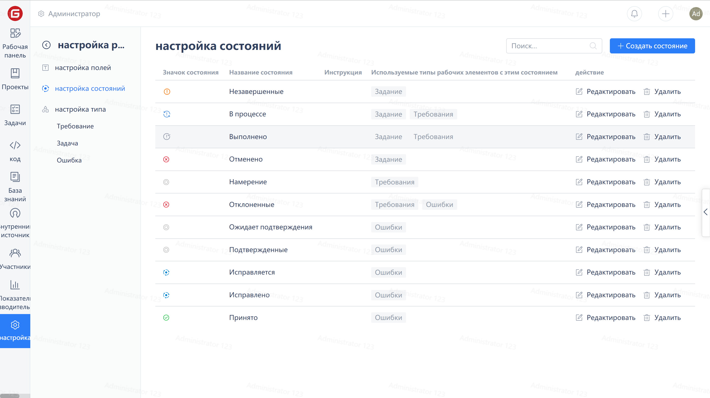

## Status Settings

Click on 'Settings' in the Enterprise Navigation Menu, then click on 'Work Item Settings' in the Enterprise Management Menu:

Click "Status Settings", you can create, edit, and delete statuses on the page.

Configure the status of work items

Click on any work item type under 'Work Item Types' and click on 'Configure Types'

Click on "Status Settings" to configure the status for the current work item

Note: Setting the status attribute correctly can help developers standardize the process and provide a basis for work item statistics.

>**To Do**: It is the initial state in the workflow, representing the start of a work item.
>
>**In Progress**: It is a process state of a workflow, indicating that the work item is in progress
>
>**Completed**: It is the end state of a workflow, indicating that the work item has been completed
>
>**Rejected**: A status of interruption in the workflow, representing non-acceptance or cancellation of the task.