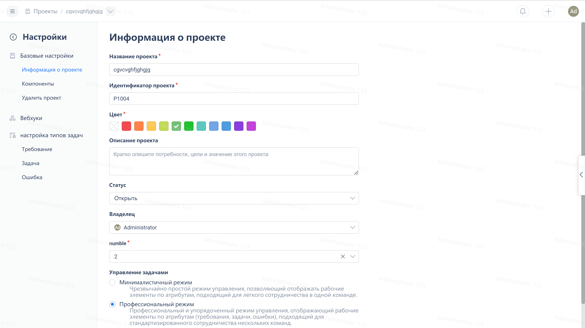
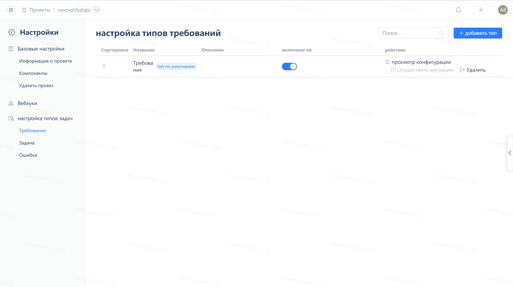
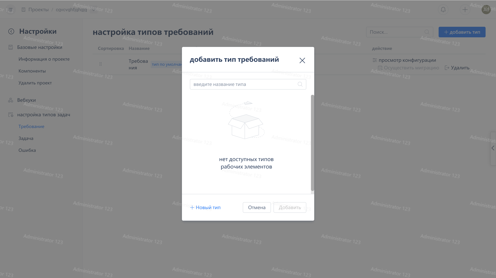
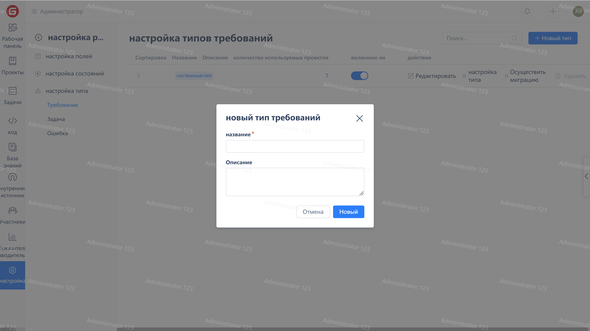

Click on the bottom of the project navigation menu, "Project Settings":

Click on the 'Work Item Settings' group to enter the settings page for that work item type.

After clicking the "Add Type" button, you can select types in the popup window and click the "Add" button to add them to the project.

If you can't find a suitable type, you can click on the 'Create Type' link in the bottom left corner to enter the enterprise management page to create a new type.

