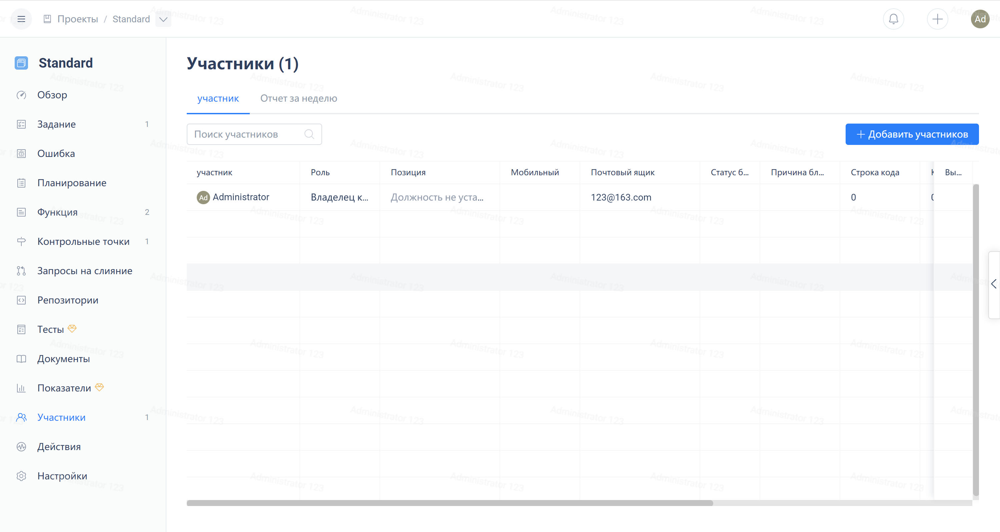
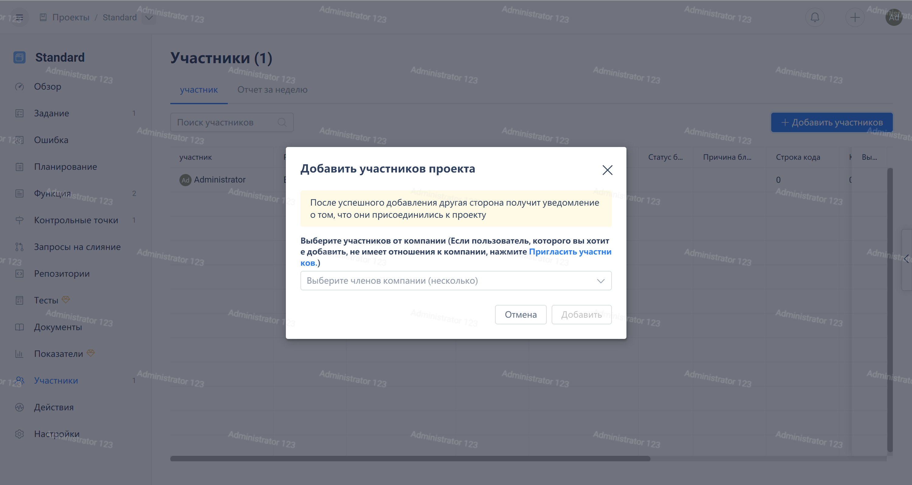
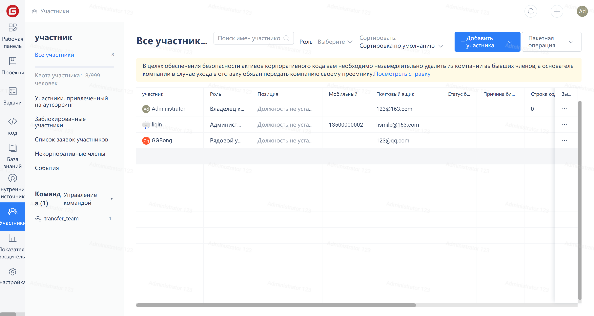
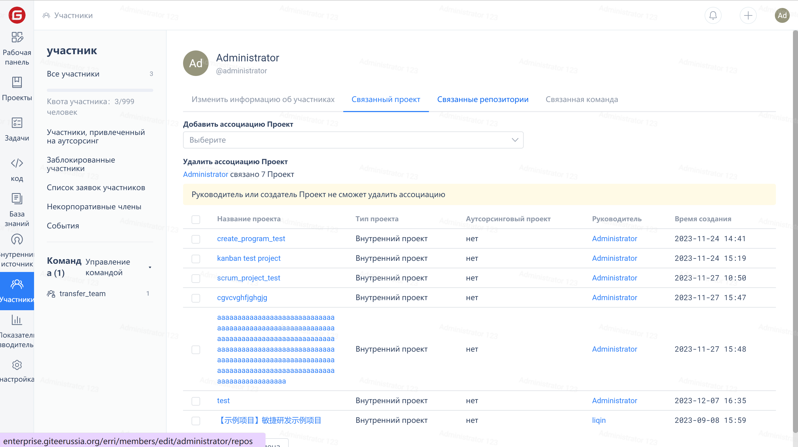

Для перехода на страницу управления участниками нажмите на "Участники" в навигационном меню проекта.

## Добавление участника проекта

Нажмите на кнопку "Добавить участника", затем отметьте участников в поле выбора и нажмите "Добавить".

## Добавление участника предприятия в несколько проектов

Для перехода на страницу управления участниками нажмите на "Участники" в навигационном меню проекта, затем нажмите на "..." в правой части строки выбранного участника и нажмите на "Редактировать" в выпадающем меню.

Нажмите на вкладку "Объединенные проекты", в выпадающем списке под "Добавить связанный проект" выберите проект и нажмите кнопку "Сохранить."

