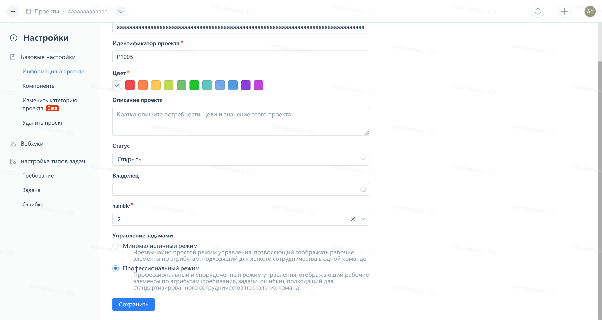

Нажмите на "Настройки проекта" внизу навигационного меню проекта:

На странице "Информация о проекте", чтобы переключить режим, нажмите на переключатель в разделе «Режим управления рабочими элементами».

