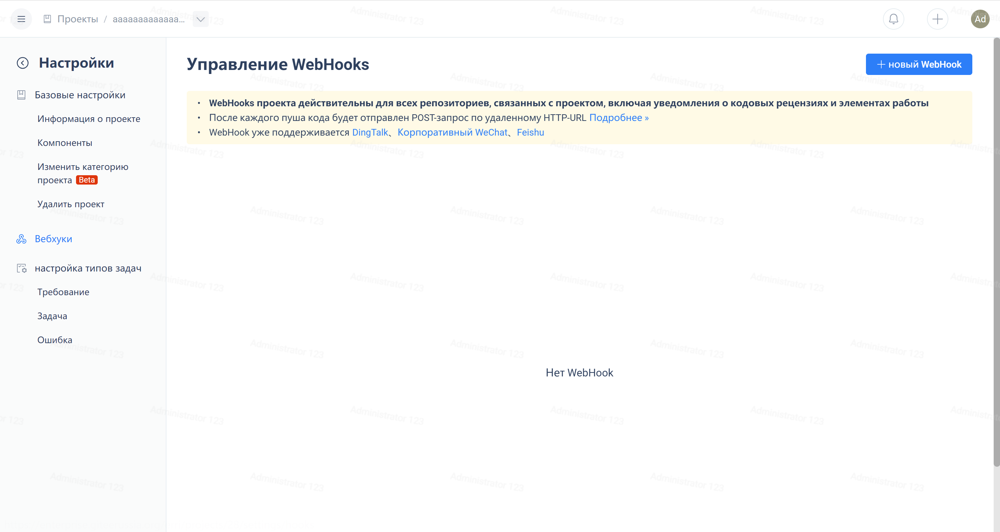
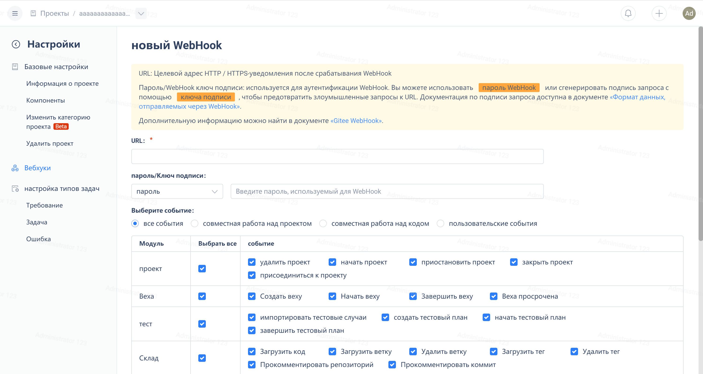

Click on the bottom of the project navigation menu, "Project Settings":

Click on "WebHooks":

Click the "New WebHook" button in the upper right corner of the page to enter the WebHook creation page.

To learn more about WebHooks, you can refer to [Enterprise Management - Function Management - WebHooks Management](/enterprise/management/functions/webhooks).