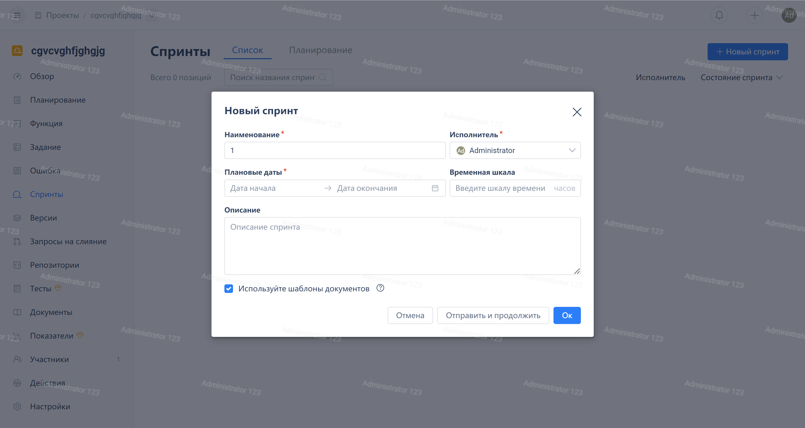

Чтобы открыть окно "Новая итерация", нажмите на "Итерации" в навигационном меню проекта Agile, затем нажмите на кнопку "Новая итерация" в правом верхнем углу. После заполнения заголовка, ответственного участника и запланированного времени нажмите кнопку "OK".

