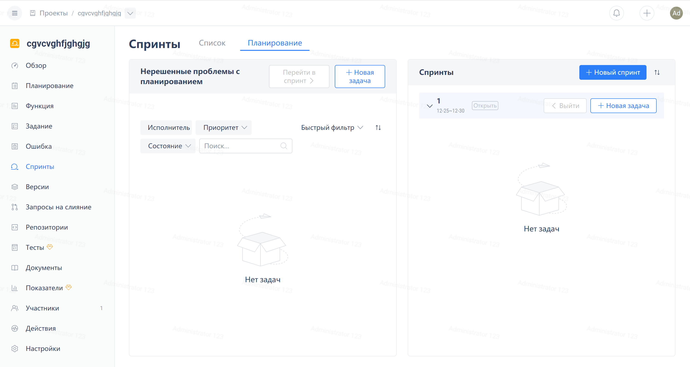
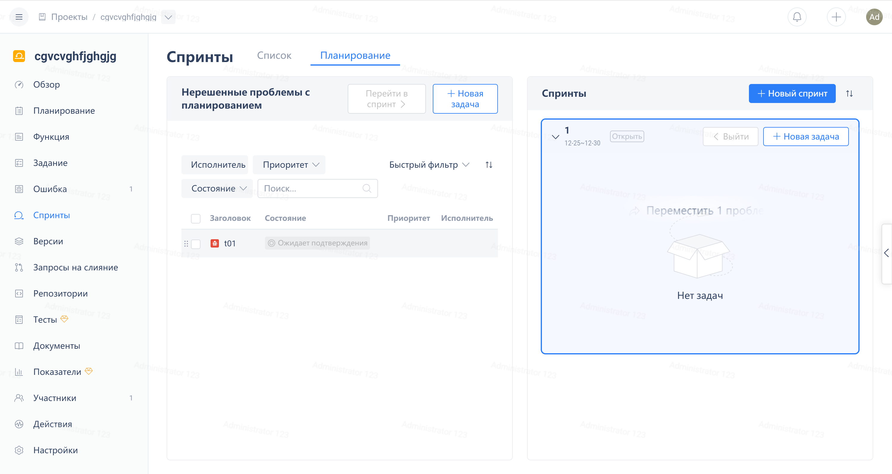
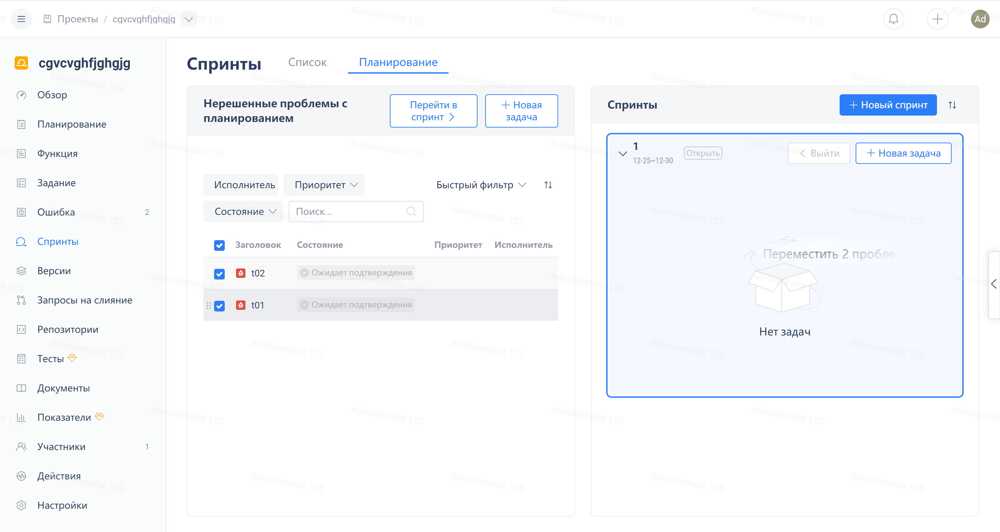

Click "Iterations" in the navigation menu of the agile project, then click the "Planning" tab, where you can allocate work items for all iterations.

In addition, planning can also be done on the work item page in the iteration, just hold the title of the work item and drag it into another iteration or the "Unplanned work item" card:

If you need to operate on multiple work items at the same time, you can first select these work items, and then drag them into the iteration card.

