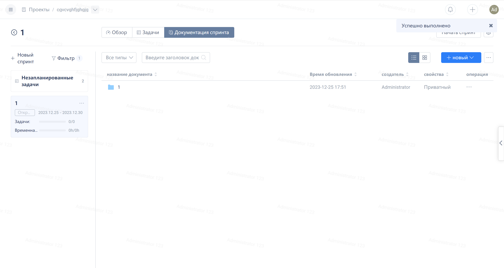

Click on 'Iteration' in the navigation menu of the Agile project, and then click on the iteration name to enter the page of that iteration.
Нажмите на "Итерации" в навигационном меню проекта Agile, а затем нажмите на заголовок итерации для перехода на страницу этой итерации.

Нажмите на "Итеративный документ".

