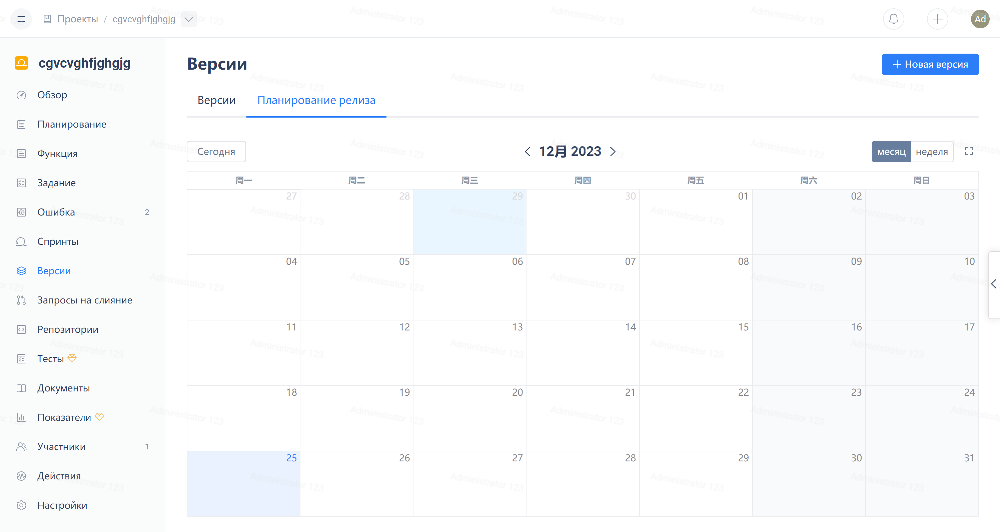

Нажмите на "Версия" в навигационном меню проекта Agile, затем нажмите на кнопку "Новая версия" в правом верхнем углу:

После заполнения номера версии, названия, ответственного и других полей, нажмите на кнопку "OK".

