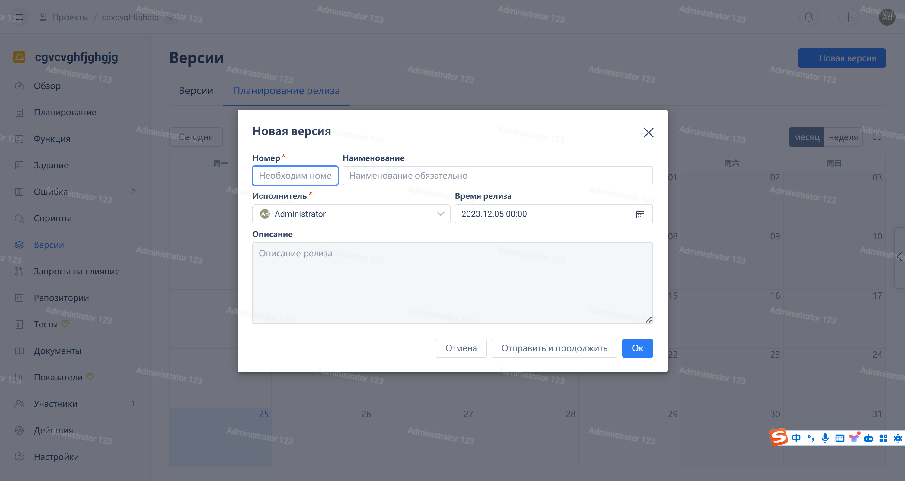

Click on "Version" in the navigation menu of the agile project, and then click the "New Version" button in the upper right corner:

After filling in the version number, title, assignee, and other fields, click the 'OK' button

