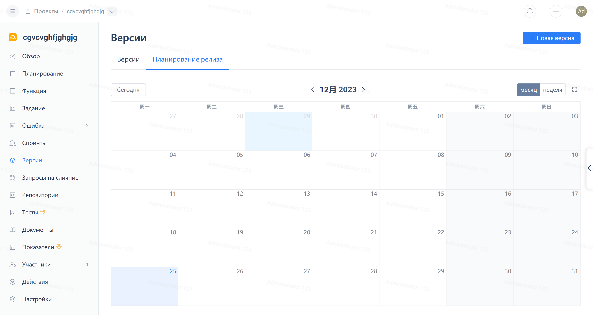

Нажмите на "Версии" в навигационном меню проекта Agile, затем нажмите на вкладку "План релиза":

Чтобы быстро открыть окно "Создать версию", нажмите на ячейку любой даты в календаре. Время релиза будет автоматически заполнено выбранной датой.

