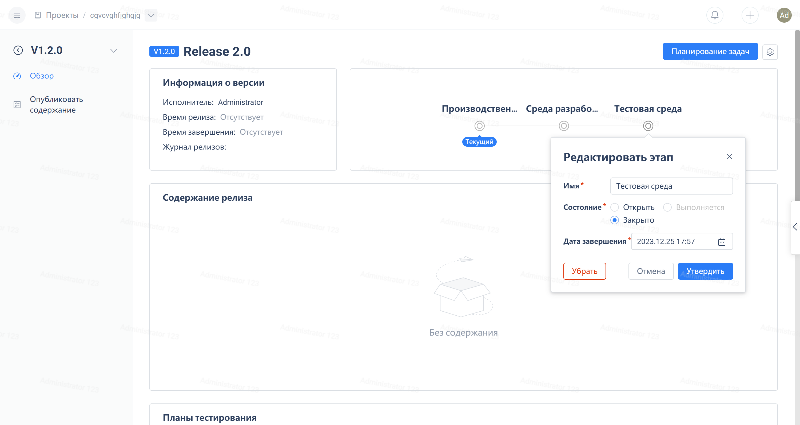
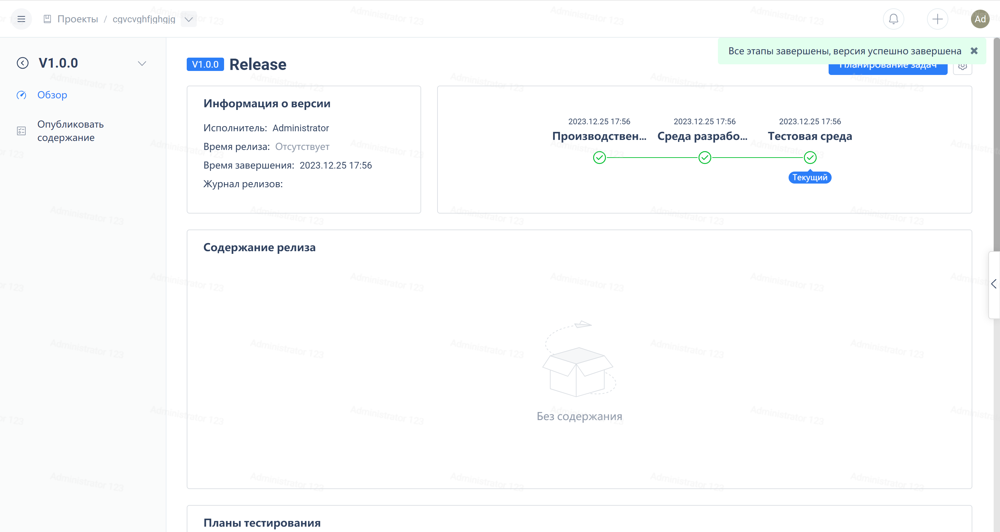

Click on 'Versions' in the navigation menu of the agile project, then click on the version title
After entering the version overview page, click on a phase to open the edit window for that phase

Afterwards, you can change the status and completion time of each stage based on the actual version.
