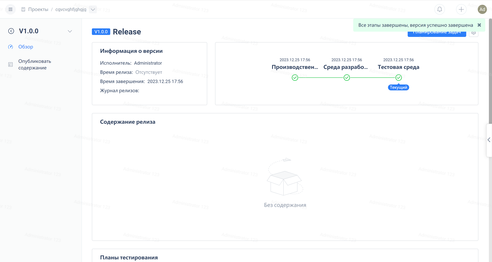

Нажмите на "Версии" в навигационном меню проекта Agile, затем нажмите на название версии
После перехода на страницу просмотра версии, нажмите на фазу, чтобы открыть окно редактирования этой фазы

Впоследствии вы можете поменять статус и время завершения каждой стадии, основываясь на актуальной версии.
