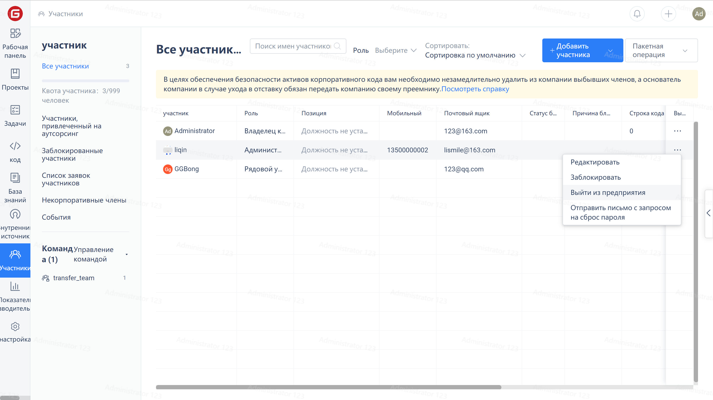
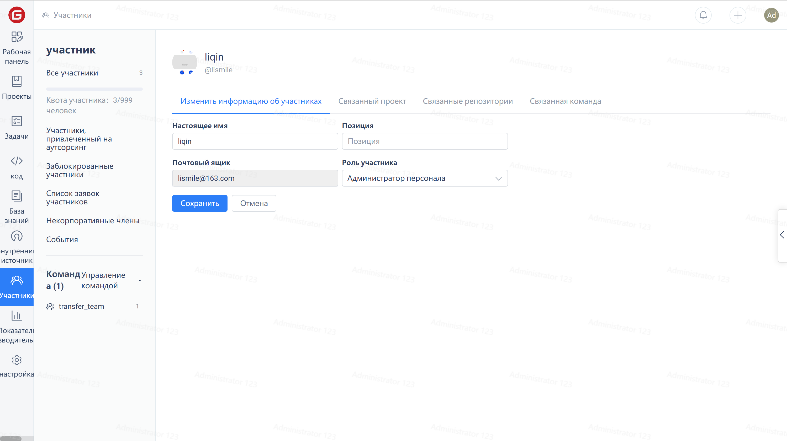

1. Log in to the admin account (or any other account with enterprise member management permissions).
2. Go to `Enterprise Workspace` -> `Members` -> `Edit Profile`

3. Change 'Joined Repositories' or 'Joined Projects' in member's profile to add repositories/projects.

