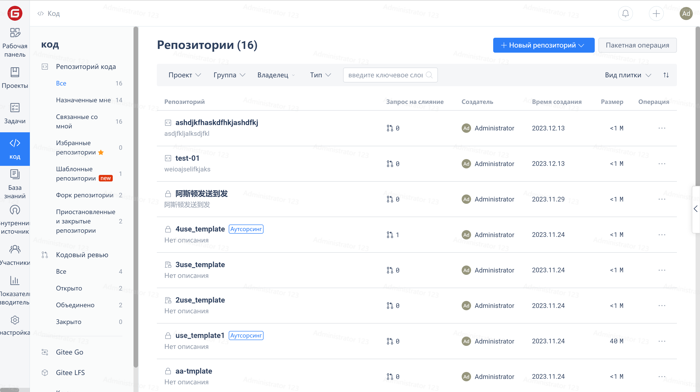
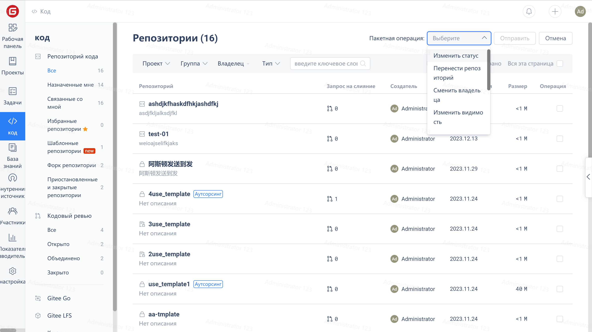

(1) В корпоративной версии войдите в систему с ролью администратора репозитория (или другими учетными записями с правами на управление участниками репозитория)
(2) Шаги операции: Панель управления предприятия -> Проект -> Репозиторий -> Пакетные операции -> Отправить

(3) Пакетные операции не поддерживаются в Personal Edition