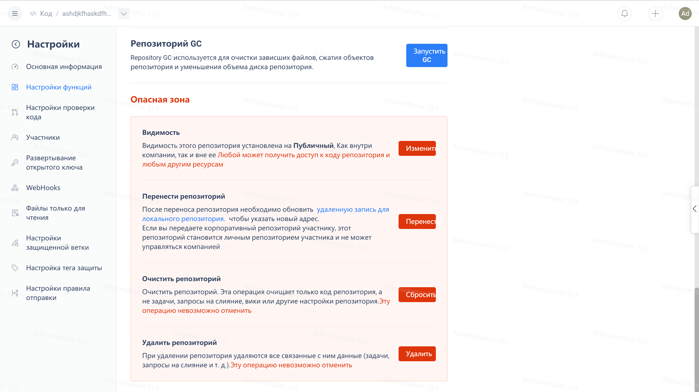
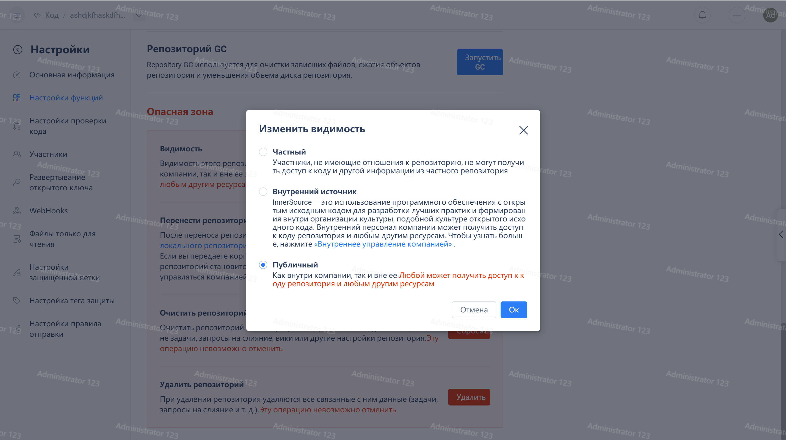
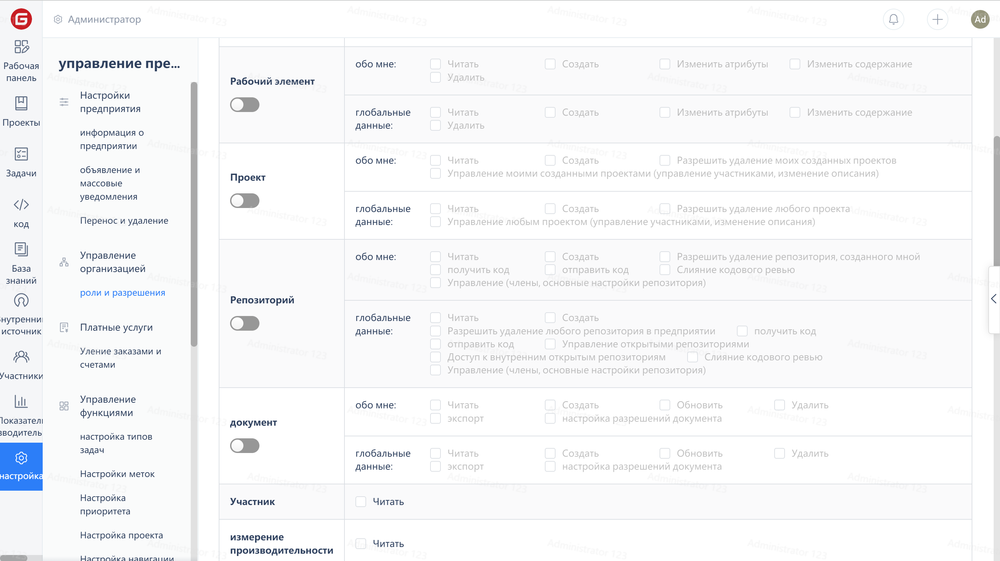

1. Распределите приоритеты между пониманием частных репозиториев, внутренних репозиториев с открытым исходным кодом и внешних репозиториев с открытым исходным кодом. Обратитесь к справочной документации: <https://gitee.ru/help/articles/4157>.
2. Чтобы настроить участников, имеющих права на управление репозиториями с открытым исходным кодом, выполните следующие действия:
3. Шаги операции: Корпоративное рабочее место -> Код -> Управление -> Настройки функций -> Видимость опасных операций -> Сохранить

> Просмотр руководства по работе с разрешениями на управление открытым исходным кодом репозитория:

Шаги операции: Корпоративное рабочее место -> Управление -> Настройки ролей и разрешений -> Управление репозиториями с открытым исходным кодом

