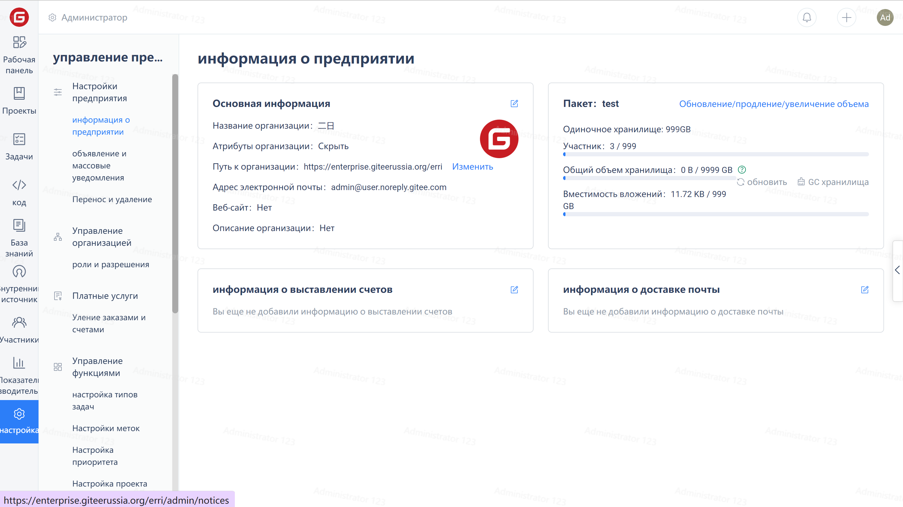

(1) В первую очередь проверьте описание квоты персональных/предпринимательских пакетов и большой объем файлов в репозитории, обратитесь к справочной документации: <https://gitee.ru/help/articles/4232>
(2) Оптимизируйте пространство хранения с помощью сборщика мусора репозитория, см. справочную документацию: <https://gitee.ru/help/articles/4173>
(3) Если используется корпоративная версия, можно просмотреть квоту пакетов для текущей версии и обновить квоту пакетов для увеличения емкости репозитория.
Шаги операции:
A. Войдите в учетную запись супер администратора предприятия (или в другие учетные записи с правами управления предприятием);
Б. Перейдите на панель управления предприятия -> Управление -> Сводная информация -> Сведения о пакете, чтобы проверить

В. Чтобы увеличить емкость одного репозитория, обновите пакет.
Руководство по обновлению пакета: 
Рабочее пространство предприятия -> Нажмите "Расширить/обновить/обновить".
При необходимости обновите соответствующий пакет