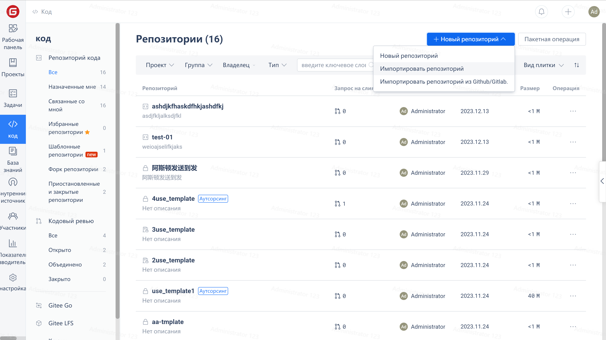
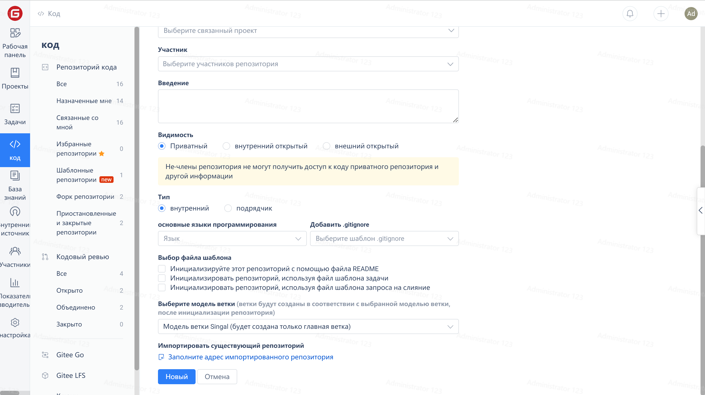
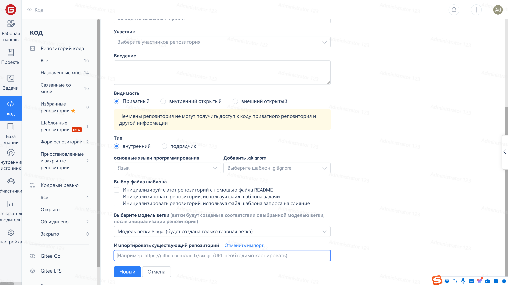

You can migrate repositories under personal accounts to enterprise accounts by importing the repository address.

1. Click on "Projects" in the enterprise interface -> "Create Repository" -> "Create Repository"

2. Click 'Fill in the repository address to import' -> Fill in the repository address that needs to be imported, and click 'Create'

