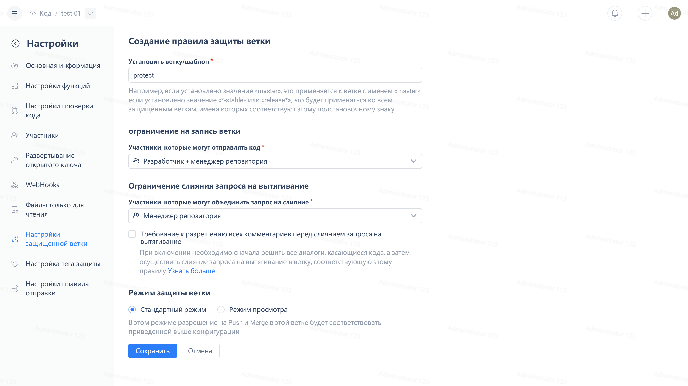
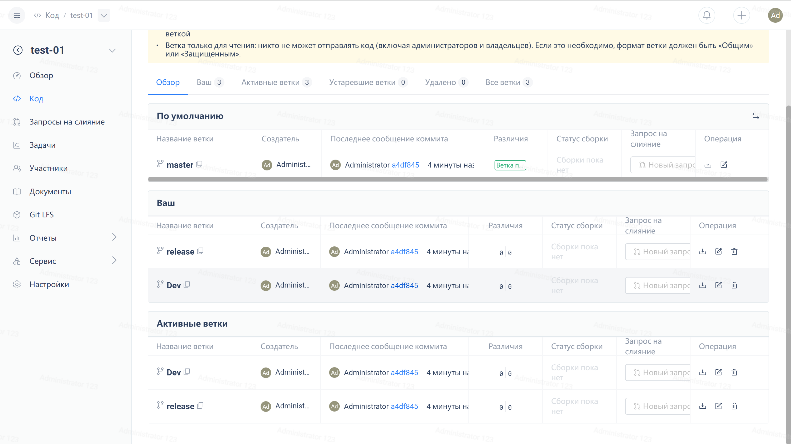
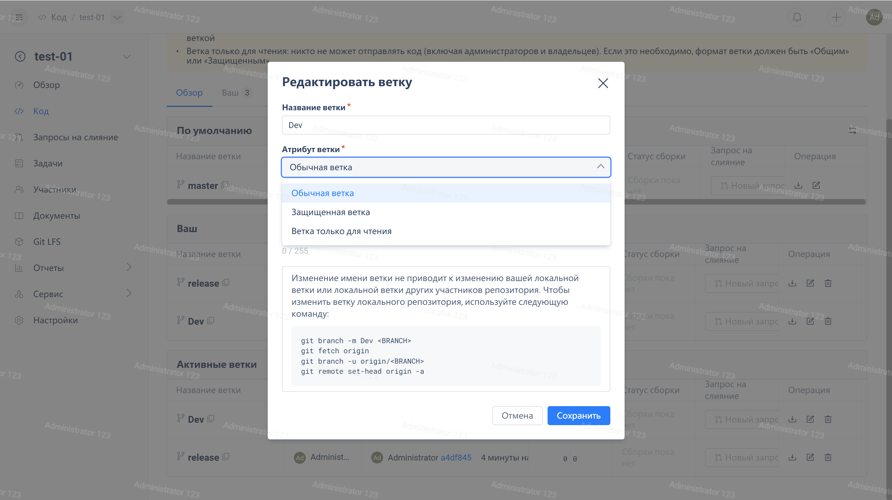
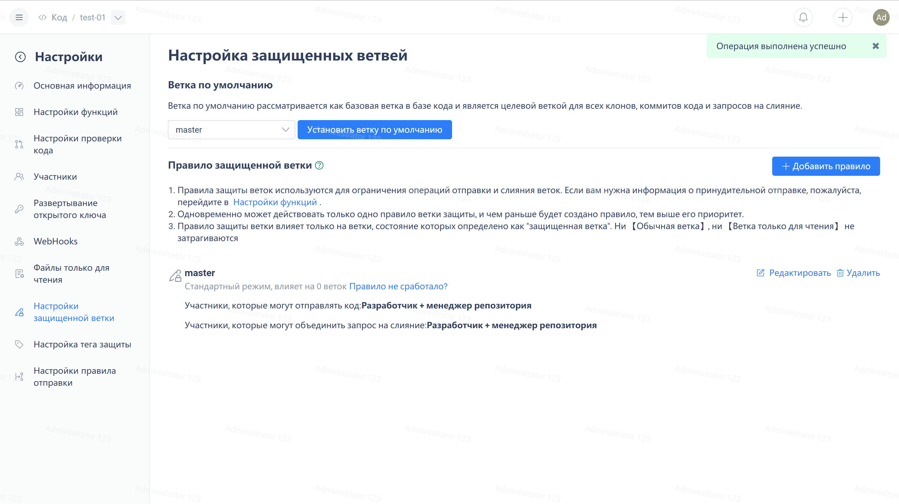
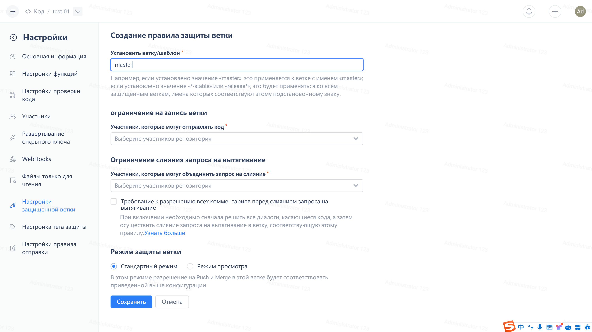
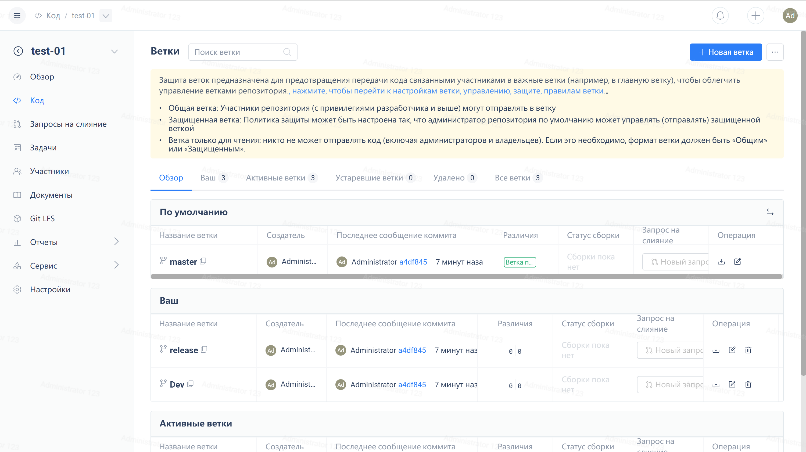

В процессе совместной работы над производственной разработкой, по соображениям внутреннего контроля, часто бывает необходимо настроить группу людей, имеющих права push и merge для определенных критических веток. В этом случае вы можете использовать функцию 'Защищенная ветка' в 'Статус ветки'.

После того как ветка будет установлена как защищенная, только участники репозитория, выбранные в соответствующих правилах защищенной ветки, смогут объединять/толкать в эту ветку, как показано на следующем рисунке:

В Gitee Enterprise Edition роли 'Супер администратор', 'Владелец предприятия' и 'Администратор' имеют права доступа к репозиториям по умолчанию.

Ниже приведены три способа настройки защищенных веток:

**Метод 1**

После создания ветки выберите ее на странице Ветки и измените статус ветки на Защищенная ветка.

По умолчанию правило защиты ветки таково, что только администраторы репозитория могут отправлять код в эту ветку и объединять запросы на притяжение, сделанные в эту ветку. Если вы хотите настроить правила, вы можете нажать на кнопку настроек справа от выпадающего окна "Защищенные ветки", чтобы перейти на страницу редактирования этого правила защиты.

**Метод 2**

1. Перейдите на страницу **Настройки защиты веток** и нажмите на кнопку **Создать правило**.

2. Введите имя/правила для защищаемой ветви и задайте содержание правил защиты.

3. Перейдите на страницу "Ветки" и установите для защищаемой ветки статус "Защищенная ветка", после чего созданное правило вступит в силу.

Если созданы только правила защиты, а статус соответствующей ветки не установлен вручную на "Защищенная ветка", ветка будет по-прежнему "Обычная ветка".

**Метод 3**

Создайте ветку на странице и введите в командную строку ее имя, соответствующее существующим правилам защищенной ветки.

Правила защиты веток действуют только на ветки со статусом "Защищенная ветка" и не влияют на "Обычные ветки" и "Ветки только для чтения".

Одновременно для ветки может действовать только одно правило, причем приоритет имеет самое раннее правило. Если правило, действующее для самой ветки, изменено (перестало удовлетворять условиям эффективности) или удалено, ветке автоматически будет соответствовать правило, удовлетворяющее условиям эффективности, в порядке убывания времени создания.